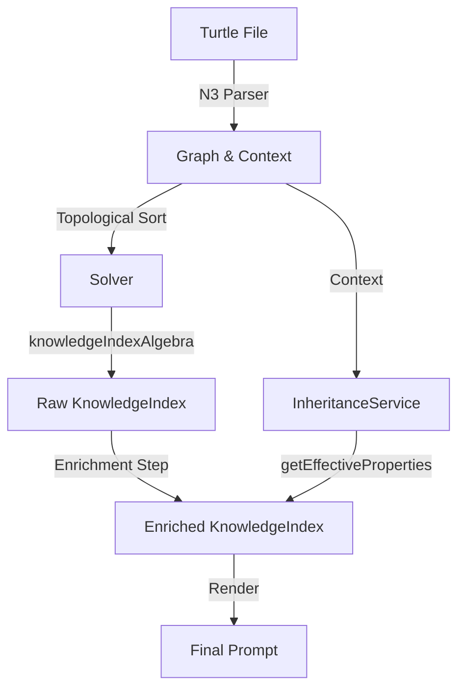

This is a fascinating architectural evolution\! You are moving from a naive string-concatenation approach to a rigorous, algebraic approach for generating prompts from ontology graphs.

Let's break this down into three pillars: **Mathematical Rigor**, **Algorithmic Analysis**, and **Software Architecture**.

### 1\. Mathematical Rigor: The Search for a True Catamorphism

The core claim in your design document is that "A prompt is a catamorphism (fold) over the ontology structure." Let's analyze if the implementation holds up to this Category Theory standard.

#### The Initial Algebra vs. The Implementation

In `rigorous-prompt-algebra.md`, you correctly identify that an ontology is the _initial algebra_ of a functor $F$.
$$F(X) = Leaf(Data) \mid Node(Data, List(X)) \mid Property(...)$$
A catamorphism ($cata$) is the unique homomorphism from this initial algebra to your carrier type (the prompt or index).

**The Discrepancy:**
In your implementation (`Graph/Builder.ts` and `Prompt/Algebra.ts`), you are constructing a `Graph` (likely using `effect/Graph`) which represents a generic directed graph, not necessarily the strict recursive tree structure implied by `Fix F`.

- **The Gap:** Your Algebra (`knowledgeIndexAlgebra`) assumes a tree-like processing (`nodeData` + `childrenResults`). If your graph has shared sub-nodes (e.g., a "Diamond" inheritance pattern where D inherits from B and C, both inheriting from A), a simple tree-recursive catamorphism would visit 'A' twice (once via B, once via C).
- **The Monoid Fix:** Fortunately, your `KnowledgeIndex` Monoid is idempotent-ish (via `HashMap` key de-duplication). If 'A' is visited twice, `HashMap.union(A, A)` collapses to `A`. This saves the correctness, but algorithmic efficiency takes a hit (re-computing 'A' multiple times).
- **Topological Fold:** A strict "Graph Catamorphism" (often called a _metamorphism_ or simply a fold over a DAG) processes nodes in reverse topological order. This ensures 'A' is processed once, and its result is passed to B and C.

#### The KnowledgeIndex Monoid

You defined `KnowledgeIndex` as a Monoid:

- **Carrier:** `HashMap<IRI, KnowledgeUnit>`
- **Identity:** `HashMap.empty()`
- **Combine:** `HashMap.union` (with a custom merge for values)

**Analysis of Laws:**

1.  **Associativity:** $(A \oplus B) \oplus C = A \oplus (B \oplus C)$. `HashMap` union is generally associative regarding keys. The complexity lies in the _values_. If two indices contain the same IRI, you call `KnowledgeUnit.merge`.
    - _Critique:_ For this to be a valid Monoid, `KnowledgeUnit.merge` must **also** be associative.
2.  **Commutativity:** Maps are unordered, so $A \oplus B$ is structurally similar to $B \oplus A$. However, if `KnowledgeUnit.merge` prefers the left or right side for conflicting fields (like `label`), you lose commutativity.
    - _Code Check:_ In `KnowledgeIndex.ts`, your `combine` function uses `HashMap.reduce(right, left, ...)`. If keys collide, it calls `KnowledgeUnit.merge(leftUnit.value, rightUnit)`. You need to ensure `KnowledgeUnit.merge` is symmetric, or accept that your Monoid is non-commutative (which matters if processing order changes).

### 2\. Algorithmic Analysis: The Inheritance Cost

The `Inheritance.ts` service highlights a classic trade-off in ontology engineering: **Materialization vs. Querying**.

#### The DFS Complexity

The `getAncestors` function performs a Depth-First Search (DFS) for every node.

```typescript
const visit = (iri: string) => ... // recursive
```

- **Complexity:** For a node $v$, computing ancestors is $O(V + E)$ in the worst case.
- **The "Fold" Multiplier:** If you run a fold over the graph (iterating every node) and call `getEffectiveProperties` (which calls `getAncestors`) for every node, your total complexity approaches $O(V \cdot (V+E))$. For large ontologies, this quadratic behavior is dangerous.

#### The Caching Opportunity

Since the ontology structure is static during a prompt generation session, `InheritanceService` is a prime candidate for **Memoization**.

- **Recommendation:** Wrap `getAncestors` and `getEffectiveProperties` with `Effect.cached` or use a `Ref` to store computed results. This reduces the amortized complexity to $O(V+E)$ for the entire graph traversal.

#### Cycle Detection

You correctly implemented cycle detection (`path` set).

- **Logic Check:** The `path.has(iri)` check is correct for detecting cycles in the _current_ recursion stack.
- **Visited Set:** The `visited.has(iri)` check correctly prunes the search space for shared ancestors (Diamond problem). This is excellent.

### 3\. Logic & Architecture: The "Pure Algebra" Tension

There is a subtle architectural tension in `Prompt/Algebra.ts` vs. `Ontology/Inheritance.ts`.

#### The Pure Algebra Limitation

Your `knowledgeIndexAlgebra` is a pure function:

```typescript
;(nodeData, childrenResults) => KnowledgeIndex
```

However, a complete `KnowledgeUnit` needs `inheritedProperties`.

- **Current State:** `inheritedProperties: []` (hardcoded).
- **The Problem:** The Algebra doesn't have access to the `InheritanceService` because it's pure. It only knows about the current node and the results from children. It doesn't know about _parents_ (ancestors).
- **Inheritance Direction:** Inheritance flows **down** (Parent -\> Child), but your catamorphism folds **up** (Children -\> Parent) or relies on topological order.

#### Solution: The "Enrichment" Phase

You need a two-pass architecture:

1.  **Pass 1 (The Fold):** Use `knowledgeIndexAlgebra` to build the `KnowledgeIndex` (the "Raw" index). This index contains isolated units.
2.  **Pass 2 (The Enrichment):** An Effectful step that iterates through the `KnowledgeIndex`, calls `InheritanceService.getEffectiveProperties(iri)` for each unit, and updates the unit.

<!-- end list -->

```typescript
// Conceptual Flow
const generatePrompt = (graph) =>
  Effect.gen(function* () {
    // 1. Pure Fold (Fast)
    const rawIndex = Solver.fold(graph, knowledgeIndexAlgebra)

    // 2. Effectful Enrichment (Service-dependent)
    const inheritance = yield* InheritanceService
    const enrichedIndex = yield* Effect.forEach(rawIndex, (unit) =>
      inheritance
        .getEffectiveProperties(unit.iri)
        .pipe(Effect.map((props) => unit.setInherited(props)))
    )
  })
```

### 4\. Deep Dive Summary & Recommendations

| Area              | Analysis                                                                                                                                | Recommendation                                                                                                  |
| :---------------- | :-------------------------------------------------------------------------------------------------------------------------------------- | :-------------------------------------------------------------------------------------------------------------- |
| **Flow Logic**    | The `Algebra` creates units with empty inherited properties. The system currently lacks the step to fill them.                          | Implement an "Enrichment Phase" after the fold that uses `InheritanceService` to populate `KnowledgeUnit` data. |
| **Algorithms**    | `InheritanceService` performs repeated DFS traversals without caching. Complexity is effectively $O(V^2)$ during full graph processing. | Add `Effect.cached` or an internal `Cache` to `getAncestors` to drop complexity to $O(V+E)$.                    |
| **Math (Monoid)** | `KnowledgeIndex` uses `HashMap`. Order of keys is undefined.                                                                            | Ensure `KnowledgeUnit.merge` is **associative** and **commutative** to guarantee the Monoid laws hold strictly. |
| **Architecture**  | Split between Pure Algebra and Effectful Services is clean but creates the data gap mentioned above.                                    | Keep the Algebra pure. Let it build the _structure_. Let the Service Layer _enrich_ the data.                   |

#### Visualizing the Flow



This architecture maintains the purity of your algebra while leveraging the power of Effect-TS for the heavy lifting of inheritance resolution.

Would you like to tackle the **Enrichment Phase** implementation next, or focus on optimizing the **Inheritance Service** with caching?
