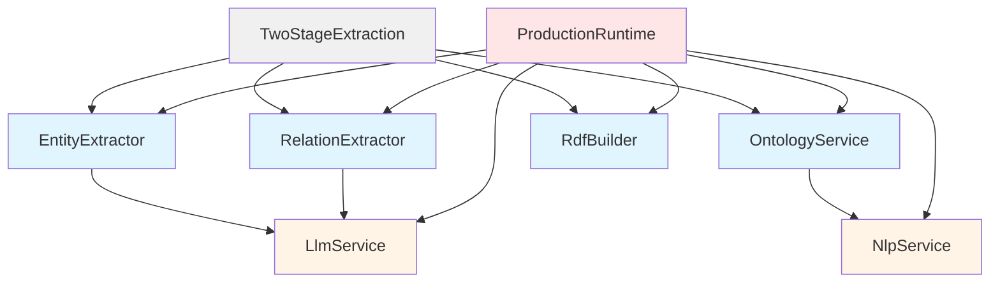

# Effect Ontology @core-v2 Migration Specification

> **Production-Grade Migration Using Effect.Service Pattern**
> 
> This specification defines the complete migration of the effect-ontology codebase using the modern `Effect.Service` interface pattern. Implementation will be in `packages/@core-v2` for a clean slate.

---

## Executive Summary

### Modern Effect.Service Pattern

Effect 3.9+ provides `Effect.Service()` which streamlines service creation by:
- **Combining Tag + Layer** in a single definition
- **Multiple construction modes**: [sync](file:///Users/pooks/Dev/effect-ontology/packages/core/src/Services/Rdf.ts#240-604), `effect`, `scoped`, `succeed`
- **Automatic dependency management** via `dependencies` array
- **Optional accessor generation** for ergonomic API
- **Type-safe dependency tree** enforced at compile time

This eliminates boilerplate and ensures services follow Effect best practices.

---

## Architecture Principles

### 1. Directory Structure (Effect Standard)

```
packages/@core-v2/src/
├── Domain/                    # Pure data types & schemas (ZERO side effects)
│   ├── Model/                 # Business domain models
│   │   ├── Entity.ts          # Entity, Relation, KnowledgeGraph
│   │   ├── Ontology.ts        # ClassDefinition, PropertyDefinition
│   │   └── index.ts
│   ├── Rdf/                   # RDF domain types
│   │   ├── Types.ts           # IRI, Triple, BlankNode, Literal
│   │   ├── Namespace.ts       # Common RDF namespaces
│   │   └── index.ts
│   ├── Error/                 # Error types hierarchy
│   │   ├── Base.ts            # Base error schemas
│   │   ├── Extraction.ts      # Extraction-specific errors
│   │   ├── Rdf.ts             # RDF processing errors
│   │   └── index.ts
│   └── index.ts
├── Service/                   # Service definitions using Effect.Service
│   ├── Extraction.ts          # EntityExtractor, RelationExtractor
│   ├── Ontology.ts            # OntologyService
│   ├── Rdf.ts                 # RdfBuilder, RdfParser
│   ├── Nlp.ts                 # NlpService, ChunkingService
│   ├── Llm.ts                 # LlmService
│   └── index.ts
├── Workflow/                  # Business logic composition
│   ├── TwoStageExtraction.ts
│   ├── StreamingExtraction.ts
│   └── index.ts
├── Schema/                    # JSON Schema generation for LLM
│   ├── EntitySchema.ts
│   ├── RelationSchema.ts
│   └── index.ts
├── Runtime/                   # Production runtime compositions
│   ├── ProductionRuntime.ts
│   ├── TestRuntime.ts
│   └── index.ts
└── index.ts                   # Public API surface
```

**Key Changes from Initial Spec:**
- **Flattened structure**: [Service/](file:///Users/pooks/Dev/effect-ontology/packages/core/src/Services/Rdf.ts#239-851) instead of `Services/` + `Layers/` (Effect.Service combines them)
- **Runtime composition**: Explicit `Runtime/` for Layer assemblies
- **Simplified**: No separate Layer directories since Effect.Service creates them inline

### 2. Effect.Service Pattern Examples

#### Basic Service (sync mode)

```typescript
// packages/@core-v2/src/Service/Nlp.ts
import { Effect, Chunk, Context } from "effect"
import winkNLP from "wink-nlp"
import model from "wink-eng-lite-web-model"
import type { TokenDocument } from "../Domain/Model/Nlp.js"

/**
 * NlpService - Natural language processing operations
 * 
 * Provides tokenization, BM25 search, and linguistic analysis using wink-nlp.
 * 
 * @since 2.0.0
 * @category Services
 */
export class NlpService extends Effect.Service<NlpService>()("NlpService", {
  // Synchronous initialization - nlp instance is stateless
  sync: () => {
    const nlp = winkNLP(model)
    
    return {
      /**
       * Tokenize text into processable document
       */
      tokenize: (text: string) =>
        Effect.sync(() => {
          const doc = nlp.readDoc(text)
          return {
            tokens: doc.tokens().out() as string[],
            sentences: doc.sentences().out() as string[],
            entities: doc.entities().out() as string[]
          } as TokenDocument
        }),
      
      /**
       * BM25 search across document collection
       */
      searchSimilar: (query: string, docs: ReadonlyArray<string>, k: number) =>
        Effect.gen(function*() {
          // BM25 implementation here
          return Chunk.empty()
        })
    }
  },
  
  // Enable accessor methods on the class itself
  accessors: true
}) {}

// Usage with accessors:
// const tokens = yield* NlpService.tokenize(text)
```

#### Service with Dependencies (effect mode)

```typescript
// packages/@core-v2/src/Service/Extraction.ts
import { Effect, Chunk } from "effect"
import { Entity, Relation } from "../Domain/Model/Entity.js"
import { ClassDefinition, PropertyDefinition } from "../Domain/Model/Ontology.js"
import { ExtractionError } from "../Domain/Error/Extraction.js"
import { LlmService } from "./Llm.js"
import { makeEntitySchema } from "../Schema/EntitySchema.js"

/**
 * EntityExtractor - Stage 1 extraction service
 * 
 * Extracts entities from text using LLM with structured output.
 * 
 * @since 2.0.0
 * @category Services
 */
export class EntityExtractor extends Effect.Service<EntityExtractor>()(
  "EntityExtractor",
  {
    // Effect-based initialization with dependencies
    effect: Effect.gen(function*() {
      const llm = yield* LlmService
      
      return {
        extract: (text: string, candidates: ReadonlyArray<ClassDefinition>) =>
          Effect.gen(function*() {
            // Generate schema from candidates
            const schema = makeEntitySchema(candidates)
            
            // Create prompt
            const prompt = `Extract entities of types: ${candidates.map(c => c.label).join(", ")}

Text: ${text}

Return JSON matching the schema.`

            // Call LLM
            const result = yield* llm.generateStructured(prompt, schema)
            
            // Decode
            const decoded = yield* Effect.try({
              try: () => Schema.decodeUnknownSync(
                Schema.Struct({ entities: Schema.Array(Entity) })
              )(result),
              catch: (error) => 
                ExtractionError.make({
                  _tag: "EntityExtractionFailed",
                  message: `Schema decode failed: ${error}`,
                  cause: error
                })
            })
            
            return Chunk.fromIterable(decoded.entities)
          })
      }
    }),
    
    // Declare dependencies - will be provided automatically
    dependencies: [LlmService.Default],
    
    // Generate accessor methods
    accessors: true
  }
) {}

/**
 * RelationExtractor - Stage 2 extraction service
 */
export class RelationExtractor extends Effect.Service<RelationExtractor>()(
  "RelationExtractor",
  {
    effect: Effect.gen(function*() {
      const llm = yield* LlmService
      
      return {
        extract: (
          text: string,
          entities: Chunk.Chunk<Entity>,
          properties: ReadonlyArray<PropertyDefinition>
        ) =>
          Effect.gen(function*() {
            // Implementation similar to EntityExtractor
            return Chunk.empty<Relation>()
          })
      }
    }),
    dependencies: [LlmService.Default],
    accessors: true
  }
) {}
```

#### Service with Scoped Resources

```typescript
// packages/@core-v2/src/Service/Rdf.ts
import { Effect, Scope, Context } from "effect"
import * as N3 from "n3"
import type { Entity, Relation } from "../Domain/Model/Entity.js"
import { RdfError } from "../Domain/Error/Rdf.js"

/**
 * RdfBuilder - RDF graph construction service
 * 
 * Manages N3.Store lifecycle with automatic cleanup.
 * 
 * @since 2.0.0
 * @category Services
 */
export class RdfBuilder extends Effect.Service<RdfBuilder>()("RdfBuilder", {
  // Scoped mode for resource management
  scoped: Effect.gen(function*() {
    // No stateful resources during service creation
    // Store creation happens per-workflow
    
    return {
      /**
       * Create scoped N3 store
       * 
       * Store will be automatically cleaned up when scope closes
       */
      makeStore: Effect.acquireRelease(
        Effect.sync(() => new N3.Store()),
        (store) => Effect.sync(() => {
          // Cleanup if needed (N3.Store is mostly GC'd, but good practice)
          store.size // Touch it to ensure it's still valid
        })
      ),
      
      /**
       * Add entities to store
       */
      addEntities: (store: N3.Store, entities: Iterable<Entity>) =>
        Effect.sync(() => {
          const { namedNode, literal, quad } = N3.DataFactory
          
          for (const entity of entities) {
            const subject = namedNode(`:${entity.id}`)
            
            // Add types
            for (const type of entity.types) {
              store.addQuad(quad(
                subject,
                namedNode("a"),
                namedNode(type)
              ))
            }
            
            // Add label
            store.addQuad(quad(
              subject,
              namedNode("rdfs:label"),
              literal(entity.mention)
            ))
            
            // Add attributes
            for (const [key, value] of Object.entries(entity.attributes)) {
              store.addQuad(quad(
                subject,
                namedNode(key),
                typeof value === "string" ? literal(value) : literal(String(value))
              ))
            }
          }
        }),
      
      /**
       * Add relations to store
       */
      addRelations: (store: N3.Store, relations: Iterable<Relation>) =>
        Effect.sync(() => {
          const { namedNode, literal, quad } = N3.DataFactory
          
          for (const rel of relations) {
            const objectTerm = typeof rel.object === "string"
              ? namedNode(`:${rel.object}`)
              : literal(String(rel.object))
              
            store.addQuad(quad(
              namedNode(`:${rel.subjectId}`),
              namedNode(rel.predicate),
              objectTerm
            ))
          }
        }),
      
      /**
       * Serialize store to Turtle
       */
      toTurtle: (store: N3.Store) =>
        Effect.async<string, RdfError>((resume) => {
          const writer = new N3.Writer({ format: "Turtle" })
          store.forEach((q) => writer.addQuad(q))
          writer.end((error, result) => {
            if (error) {
              resume(Effect.fail(RdfError.make({
                _tag: "SerializationFailed",
                message: `Turtle serialization failed: ${error}`,
                cause: error
              })))
            } else {
              resume(Effect.succeed(result))
            }
          })
        })
    }
  }),
  
  accessors: true
}) {}
```

#### Ontology Service with Multiple Implementations

```typescript
// packages/@core-v2/src/Service/Ontology.ts
import { Effect, Chunk, Context, Layer } from "effect"
import { ClassDefinition, PropertyDefinition } from "../Domain/Model/Ontology.js"
import { OntologyError } from "../Domain/Error/Ontology.js"
import { NlpService } from "./Nlp.js"

/**
 * OntologyService - Ontology query operations
 * 
 * Provides class search and property lookup.
 * Multiple implementations available: BM25, Embeddings.
 * 
 * @since 2.0.0
 * @category Services
 */
export class OntologyService extends Effect.Service<OntologyService>()(
  "OntologyService",
  {
    effect: Effect.gen(function*() {
      const nlp = yield* NlpService
      
      return {
        /**
         * Search for relevant classes given text context
         */
        searchClasses: (text: string, limit: number = 10) =>
          Effect.gen(function*() {
            // Search implementation (BM25 or embeddings)
            return Chunk.empty<ClassDefinition>()
          }),
        
        /**
         * Get properties allowed for given class IDs
         */
        getPropertiesFor: (classIds: ReadonlyArray<string>) =>
          Effect.gen(function*() {
            // Property lookup implementation
            return Chunk.empty<PropertyDefinition>()
          })
      }
    }),
    dependencies: [NlpService.Default],
    accessors: true
  }
) {}

// Alternative implementation using embeddings
export const OntologyServiceEmbeddings = Layer.effect(
  OntologyService,
  Effect.gen(function*() {
    // Different implementation using vector search
    return OntologyService.of({
      searchClasses: (text, limit = 10) =>
        Effect.gen(function*() {
          // Embedding-based search
          return Chunk.empty<ClassDefinition>()
        }),
      getPropertiesFor: (classIds) =>
        Effect.gen(function*() {
          return Chunk.empty<PropertyDefinition>()
        })
    })
  })
)
```

### 3. Workflow Composition

```typescript
// packages/@core-v2/src/Workflow/TwoStageExtraction.ts
import { Effect } from "effect"
import { EntityExtractor, RelationExtractor } from "../Service/Extraction.js"
import { OntologyService } from "../Service/Ontology.js"
import { RdfBuilder } from "../Service/Rdf.js"

/**
 * Two-Stage Extraction Workflow
 * 
 * Uses Effect.Service accessors for clean, readable code.
 * Dependencies automatically provided via Layer composition.
 * 
 * @param text - Source text to extract from
 * @returns Turtle RDF string
 */
export const extractToTurtle = (text: string) =>
  Effect.gen(function*() {
    // Access services via accessors (enabled by accessors: true)
    const classes = yield* OntologyService.searchClasses(text)
    
    if (classes.length === 0) {
      return "" // Empty graph
    }
    
    // Stage 1: Extract entities
    const entities = yield* EntityExtractor.extract(text, classes)
    
    if (entities.length === 0) {
      return ""
    }
    
    // Get allowed properties for entity types
    const classIds = entities.flatMap(e => e.types)
    const properties = yield* OntologyService.getPropertiesFor(classIds)
    
    // Stage 2: Extract relations
    const relations = yield* RelationExtractor.extract(
      text,
      entities,
      properties
    )
    
    // Build RDF graph with scoped store
    return yield* Effect.scoped(
      Effect.gen(function*() {
        const store = yield* RdfBuilder.makeStore
        
        yield* RdfBuilder.addEntities(store, entities)
        yield* RdfBuilder.addRelations(store, relations)
        
        return yield* RdfBuilder.toTurtle(store)
      })
    )
  })
```

### 4. Runtime Composition

```typescript
// packages/@core-v2/src/Runtime/ProductionRuntime.ts
import { Layer, ManagedRuntime } from "effect"
import { EntityExtractor, RelationExtractor } from "../Service/Extraction.js"
import { OntologyService } from "../Service/Ontology.js"
import { RdfBuilder } from "../Service/Rdf.js"
import { NlpService } from "../Service/Nlp.js"
import { LlmService } from "../Service/Llm.js"

/**
 * Production Runtime
 * 
 * Composes all service layers into executable runtime.
 * Dependency tree automatically resolved by Effect.
 */
export const ProductionLayers = Layer.mergeAll(
  EntityExtractor.Default,      // Brings in LlmService.Default
  RelationExtractor.Default,    // Brings in LlmService.Default
  OntologyService.Default,      // Brings in NlpService.Default
  RdfBuilder.Default,
  NlpService.Default,
  LlmService.Default
)

export const ProductionRuntime = ManagedRuntime.make(ProductionLayers)

// Usage:
// ProductionRuntime.runPromise(extractToTurtle(text))
```

---

## Dependency Tree



**Legend:**
- Blue: Extraction services
- Orange: Infrastructure services
- Gray: Workflows
- Red: Runtime composition

---

## Key Benefits of Effect.Service Pattern

### 1. Less Boilerplate

**Before (manual Tag + Layer):**
```typescript
// Define Tag
export class MyService extends Context.Tag("MyService")<
  MyService,
  { readonly operation: () => Effect.Effect<string> }
>() {}

// Define Layer separately
export const MyServiceLive = Layer.effect(
  MyService,
  Effect.gen(function*() {
    return MyService.of({
      operation: () => Effect.succeed("result")
    })
  })
)

// Wire dependencies manually
const layer = MyServiceLive.pipe(Layer.provide(DependencyLayer))
```

**After (Effect.Service):**
```typescript
export class MyService extends Effect.Service<MyService>()("MyService", {
  sync: () => ({
    operation: () => Effect.succeed("result")
  }),
  dependencies: [Dependency.Default],  // Automatic!
  accessors: true                        // Automatic accessors!
}) {}

// Usage:
const result = yield* MyService.operation()  // Clean accessor API
```

### 2. Type-Safe Dependency Management

Dependencies declared inline are **automatically provided** when using `.Default` layer:

```typescript
export class ServiceA extends Effect.Service<ServiceA>()("ServiceA", {
  sync: () => ({ foo: () => Effect.succeed(1) })
}) {}

export class ServiceB extends Effect.Service<ServiceB>()("ServiceB", {
  effect: Effect.gen(function*() {
    const a = yield* ServiceA  // Dependency injected
    return {
      bar: () => Effect.gen(function*() {
        const x = yield* a.foo()
        return x + 1
      })
    }
  }),
  dependencies: [ServiceA.Default]  // Explicit, type-checked
}) {}

// ServiceB.Default already includes ServiceA.Default!
Layer.mergeAll(ServiceB.Default) // ✅ Complete, no missing deps
```

### 3. Clean Public API with Accessors

```typescript
export class MyService extends Effect.Service<MyService>()("MyService", {
  sync: () => ({
    operation: (x: number) => Effect.succeed(x * 2)
  }),
  accessors: true
}) {}

// Without accessors:
const result = yield* Effect.flatMap(MyService, svc => svc.operation(5))

// With accessors:
const result = yield* MyService.operation(5)  // ✨ Much cleaner!
```

---

## Migration Plan

### Phase 1: Domain Layer (Week 1)

**Tasks:**
1. Create `Domain/Model/Entity.ts` - Schema classes for Entity, Relation, KnowledgeGraph
2. Create `Domain/Model/Ontology.ts` - ClassDefinition, PropertyDefinition
3. Create `Domain/Rdf/Types.ts` - Branded IRI, Triple, Literal
4. Create `Domain/Error/*` - Tagged error hierarchy

**Deliverable**: Pure domain models with Schema validation

### Phase 2: Core Services (Week 2-3)

**Tasks:**
1. Implement `Service/Nlp.ts` - NlpService (sync mode)
2. Implement `Service/Llm.ts` - LlmService (effect mode, wraps @effect/ai)
3. Implement `Service/Rdf.ts` - RdfBuilder (scoped mode for N3.Store)
4. Implement `Service/Ontology.ts` - OntologyService (effect mode with NlpService dependency)

**Deliverable**: All infrastructure services with clean Effect.Service pattern

### Phase 3: Extraction Services (Week 4)

**Tasks:**
1. Implement `Service/Extraction.ts` - EntityExtractor and RelationExtractor
2. Implement `Schema/EntitySchema.ts` - Dynamic schema generation
3. Implement `Schema/RelationSchema.ts`
4. Add unit tests for each service

**Deliverable**: Complete two-stage extraction services

### Phase 4: Workflows & Runtime (Week 5)

**Tasks:**
1. Implement `Workflow/TwoStageExtraction.ts`
2. Implement `Runtime/ProductionRuntime.ts`
3. Implement `Runtime/TestRuntime.ts` with mocks
4. Integration tests with Football dataset

**Deliverable**: End-to-end working extraction pipeline

### Phase 5: Advanced Features (Week 6-7)

**Tasks:**
1. Implement `Workflow/StreamingExtraction.ts`
2. Add SHACL validation integration
3. Add distributed tracing
4. Performance optimization

**Deliverable**: Production-ready features

### Phase 6: Migration & Documentation (Week 8)

**Tasks:**
1. Side-by-side comparison tests (v1 vs v2)
2. Migration guide for existing users
3. API documentation
4. Benchmark report

**Deliverable**: Complete migration package

---

## Verification Plan

### Unit Tests

```typescript
// Example test using TestRuntime
import { Effect, Layer } from "effect"
import { EntityExtractor } from "../Service/Extraction.js"
import { LlmService } from "../Service/Llm.js"
import { describe, it, expect } from "vitest"

describe("EntityExtractor", () => {
  it("should extract entities from text", () =>
    Effect.gen(function*() {
      const result = yield* EntityExtractor.extract(
        "Cristiano Ronaldo plays soccer.",
        [soccerPlayerClass]
      )
      
      expect(result.length).toBeGreaterThan(0)
    }).pipe(
      Effect.provide(
        Layer.mergeAll(
          EntityExtractor.Default,
          Layer.succeed(LlmService, createMockLlm())  // Mock LLM
        )
      ),
      Effect.runPromise
    )
  )
})
```

### Integration Tests

- **Football Dataset**: Extract from "Cristiano Ronaldo plays for Al-Nassr"
- **Large Document**: 10-page streaming extraction
- **Error Cases**: Malformed text, missing ontology classes

### Benchmarks

- Token usage comparison (v1 vs v2)
- Latency percentiles
- Memory usage
- Concurrent extraction throughput

---

## Success Metrics

| Metric | Target | Measurement |
|--------|--------|-------------|
| Boilerplate Reduction | 50%+ fewer LOC for service defs | Line count comparison |
| Type Safety | 100% typed dependencies | TypeScript strict mode |
| Test Coverage | >80% | Vitest coverage |
| Token Efficiency | 30-50% reduction | LLM token tracking |
| Extraction F1 Score | >0.85 | Test dataset evaluation |

---

## Reference: Effect.Service Modes

| Mode | Use Case | Example |
|------|----------|---------|
| [sync](file:///Users/pooks/Dev/effect-ontology/packages/core/src/Services/Rdf.ts#240-604) | Stateless, synchronous initialization | NLP processor, config parser |
| `effect` | Async initialization or dependencies | Service needing other services |
| `scoped` | Resources needing cleanup | Database connections, file handles |
| `succeed` | Static value injection | Configuration objects |

---

## Next Steps

1. ✅ Review this refined specification
2. Create `packages/@core-v2` package structure
3. Begin Phase 1: Domain Layer implementation
4. Iterate based on early feedback

---

## Appendix: Clean Export Pattern

```typescript
// packages/@core-v2/src/index.ts

// Domain (pure types, no service dependencies)
export * as Domain from "./Domain/index.js"

// Services (Effect.Service classes with .Default layers)
export { EntityExtractor } from "./Service/Extraction.js"
export { RelationExtractor } from "./Service/Extraction.js"
export { OntologyService } from "./Service/Ontology.js"
export { RdfBuilder } from "./Service/Rdf.js"
export { NlpService } from "./Service/Nlp.js"
export { LlmService } from "./Service/Llm.js"

// Workflows (composable business logic)
export { extractToTurtle } from "./Workflow/TwoStageExtraction.js"
export { streamingExtraction } from "./Workflow/StreamingExtraction.js"

// Runtime (pre-composed layers)
export { ProductionRuntime, ProductionLayers } from "./Runtime/ProductionRuntime.js"
export { TestRuntime, TestLayers } from "./Runtime/TestRuntime.js"

// Re-export Schema utilities
export * as Schema from "./Schema/index.js"
```

**Usage:**
```typescript
import { 
  extractToTurtle,
  ProductionRuntime 
} from "@effect-ontology/core-v2"

ProductionRuntime.runPromise(
  extractToTurtle("Your text here")
).then(console.log)
```
