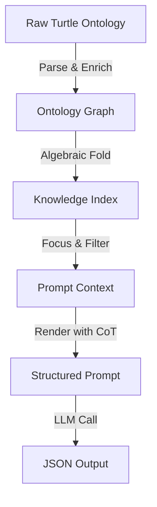

# Production Spec: Prompt Optimization & Semantic Enrichment

## 1. Executive Summary
This specification outlines the "Prompt Optimization" initiative to improve ontology extraction accuracy by 20-30% (target F1 score > 0.6). The strategy involves upgrading the existing "Algebraic Prompt Construction" pipeline to support **Semantic Enrichment** (synonyms, examples, comments) and **Chain-of-Thought (CoT)** reasoning.

**Core Philosophy**: Upgrade existing services (`Graph`, `Prompt`, `Extraction`) rather than creating new ones. Leverage the existing Monoidal Algebra for prompt composition.

## 2. Architecture & Data Flow

The data flow will be enhanced to carry semantic metadata from the raw RDF ontology all the way to the LLM prompt.



### Key Upgrades
1.  **Graph Layer**: `ClassNode` and `PropertyNode` will now store `rdfs:comment` (definition), `skos:altLabel` (synonyms), and `skos:example`.
2.  **Algebra Layer**: `KnowledgeUnit` AST will be extended to hold this semantic data.
3.  **Render Layer**: The renderer will format this data into rich "Few-Shot" style descriptions and inject "Chain-of-Thought" instructions.

## 3. Detailed Component Specifications

### 3.1. Graph Service Upgrades (`packages/core/src/Graph`)

#### `Types.ts`
Extend `ClassNode` and `PropertyNode` schemas to include semantic metadata.

```typescript
// Upgrade ClassNode
export class ClassNode extends Schema.Class<ClassNode>("ClassNode")({
  // ... existing fields ...
  comment: Schema.Option(Schema.String), // rdfs:comment
  synonyms: Schema.Array(Schema.String), // skos:altLabel
  examples: Schema.Array(Schema.String)  // skos:example
})

// Upgrade PropertyNode similarly
```

#### `Builder.ts`
Update `parseTurtleToGraph` to extract these predicates.
- `rdfs:comment` -> `comment`
- `skos:altLabel` -> `synonyms`
- `skos:example` -> `examples`

### 3.2. Prompt Service Upgrades (`packages/core/src/Prompt`)

#### `Ast.ts`
Upgrade `KnowledgeUnit` to carry the new data.

```typescript
export class KnowledgeUnit extends Data.Class<{
  // ... existing fields ...
  readonly comment: Option.Option<string>
  readonly synonyms: ReadonlyArray<string>
  readonly examples: ReadonlyArray<string>
}> {
  // Update merge() logic to union synonyms/examples and pick longest comment
}
```

#### `Algebra.ts`
Update `knowledgeIndexAlgebra` to map from `ClassNode`/`PropertyNode` to `KnowledgeUnit`.

#### `ConstraintFormatter.ts`
Add new formatters for the enriched data.
- `synonymsDoc(synonyms: string[])`: "Synonyms: foo, bar"
- `examplesDoc(examples: string[])`: "Examples: baz, qux"

#### `Render.ts`
1.  **Rich Definitions**: Update `formatUnit` to include the comment, synonyms, and examples in the class definition block.
2.  **CoT Injection**: Update `renderToStructuredPrompt` to add a "Reasoning Strategy" section.

```text
SYSTEM INSTRUCTIONS:
...
REASONING STRATEGY:
1. Analyze the input text to identify potential entities.
2. For each entity, determine its most specific class from the allowed list.
3. Extract properties based on the schema constraints.
...
```

### 3.3. Extraction Service Upgrades (`packages/core/src/Services`)

#### `Llm.ts`
Update `extractKnowledgeGraphTwoStage` to handle potential CoT output.
- If the LLM is prompted to "think" before outputting JSON, the response might contain text before the JSON block.
- **Action**: Ensure the JSON parser (`Json.parse` or custom extractor) is robust to leading/trailing text (e.g., using a regex to find the first `{` and last `}`).

## 4. Implementation Plan & File Changes

| File | Status | Change Description |
| :--- | :--- | :--- |
| `packages/core/src/Graph/Types.ts` | MODIFY | Add `comment`, `synonyms`, `examples` to schemas. |
| `packages/core/src/Graph/Builder.ts` | MODIFY | Extract `rdfs:comment`, `skos` predicates during parsing. |
| `packages/core/src/Prompt/Ast.ts` | MODIFY | Add fields to `KnowledgeUnit` and update `merge`. |
| `packages/core/src/Prompt/Algebra.ts` | MODIFY | Map Node data to KnowledgeUnit. |
| `packages/core/src/Prompt/ConstraintFormatter.ts` | MODIFY | Add formatters for new fields. |
| `packages/core/src/Prompt/Render.ts` | MODIFY | Render rich definitions and CoT instructions. |
| `packages/core/src/Services/Llm.ts` | CHECK | Verify JSON parsing robustness. |

## 5. Verification Strategy

1.  **Unit Tests**:
    -   Update `test-enriched-prompts.ts` to verify that `rdfs:comment` and `skos:altLabel` from the FOAF ontology are correctly propagated to the final prompt.
2.  **Regression Tests**:
    -   Run `benchmarks/scripts/test-real-extraction.ts` to ensure no regression in basic extraction.
3.  **Benchmark Run**:
    -   Run the full benchmark suite (`benchmarks/src/cli.ts`) to measure F1 score improvement.

## 6. Dependencies
-   `@effect/schema`: For updating Node schemas.
-   `n3`: For parsing the additional RDF predicates.
-   `effect`: For standard functional patterns.
