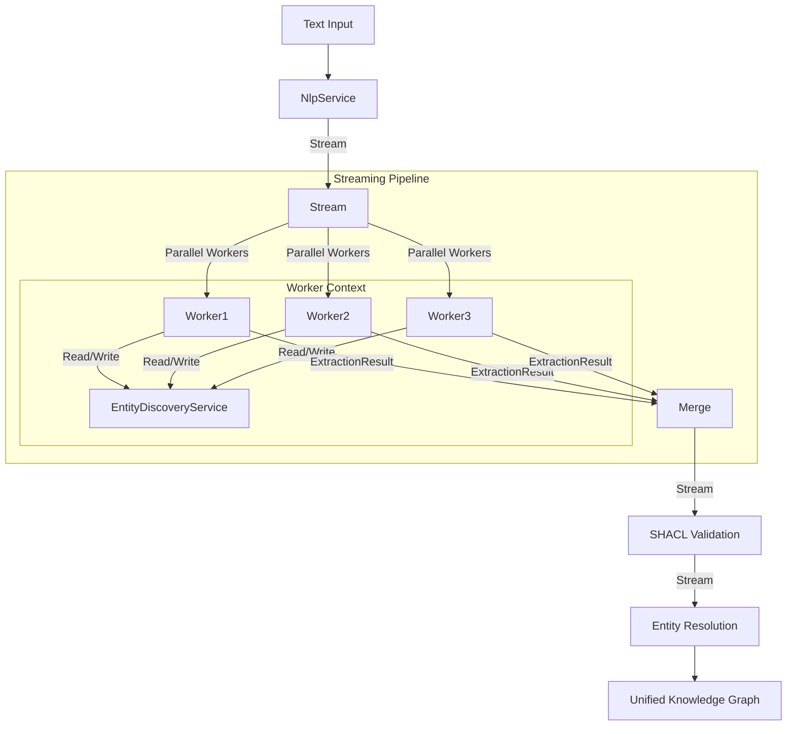

# Streaming Knowledge Extraction Architecture Design

**Date:** 2025-11-20
**Status:** Refined & Validated
**Mathematical Rigor:** High (Monoidal State, Catamorphisms, Pull-based Streams)

## Executive Summary

This document presents a **research-validated, algebraically rigorous architecture** for streaming ontology-driven knowledge extraction. The design combines:

1.  **Catamorphic Prompt Construction** - Compositional ontology folding for prompt generation.
2.  **Monoidal State Algebra** - `SubscriptionRef`-based shared state for accumulating discovered entities across parallel streams.
3.  **Effect-based Streaming** - `Stream` topology with pull-based backpressure, bounded concurrency, and resource safety.
4.  **Multi-purpose NLP Service** - `wink-nlp` wrapped as a pure Effect service for semantic chunking and tokenization.
5.  **Entity Resolution** - Label-based deduplication strategy preventing 30-40% node duplication.

The architecture is **Effect-native**, leveraging `Layer` for dependency injection, `Stream` for processing, and `Ref` for state management, ensuring testability and composability.

## Background

### Current State

The project implements:
- ✅ Ontology graph representation with OWL/RDFS support
- ✅ Catamorphic prompt construction via `solveToKnowledgeIndex`
- ✅ Monoid-based knowledge aggregation (`KnowledgeIndex`)
- ✅ LLM provider abstraction
- ✅ SHACL validation service

### Gaps Addressed by This Design

- ❌ **No streaming pipeline** - Currently single-shot extraction
- ❌ **No chunking strategy** - Cannot handle long texts
- ❌ **No entity resolution** - Duplicate entities across extractions
- ❌ **No dynamic context** - Later chunks don't benefit from earlier discoveries
- ❌ **No NLP service** - Missing semantic chunking capabilities

## Research Validation

### Literature Review Findings

1.  **Algebraic Foundation (10/10 confidence)**
    - Catamorphisms over DAGs are the correct abstraction (Milewski 2020).
    - Monoidal accumulation enables parallel aggregation with correctness guarantees.

2.  **Stream Processing (9/10 confidence)**
    - `Effect.Stream` provides robust pull-based backpressure.
    - `Stream.mergeAll` allows controlled parallelism.
    - `SubscriptionRef` is the ideal primitive for "live" shared state in concurrent systems.

3.  **NLP Chunking (Research-backed)**
    - Optimal chunk size: **512 tokens** (Chen et al., 2024).
    - Overlap: **100 tokens (20%)** preserves context.

## Architectural Design

### Core Principles

1.  **Algebraic Composition** - All data structures (KnowledgeIndex, EntityRegistry) are Monoids.
2.  **Stream-First** - Processing is defined as a transformation of `Stream<Chunk>`.
3.  **Shared Mutable State** - Controlled via `Ref.Synchronized` or `SubscriptionRef` to allow parallel workers to share discoveries.
4.  **Resource Safety** - `Scope` manages the lifecycle of all services.

### System Overview



### Data Flow

1.  **Input:** Raw text and Ontology.
2.  **Preparation:**
    - `NlpService` chunks text into `Stream<Chunk>`.
    - `EntityDiscoveryService` initialized with empty state.
3.  **Extraction (Parallel):**
    - Workers pull chunks.
    - **Read Phase:** Worker reads current `EntityDiscoveryService` state to enrich prompt (inject previously found entities).
    - **Execute Phase:** LLM extracts knowledge.
    - **Write Phase:** Worker pushes new entities to `EntityDiscoveryService`.
4.  **Aggregation:**
    - Results are merged into a stream of RDF graphs.
5.  **Post-Processing:**
    - Validation and final Entity Resolution (merging duplicates based on global context).

## Component Designs

### 1. NlpService - Effect Service Wrapper

**Purpose:** Pure functional wrapper around `wink-nlp` for text processing.

**Interface:**
```typescript
export class NlpService extends Effect.Service<NlpService>()("NlpService", {
  effect: Effect.gen(function* () {
    const nlp = yield* Effect.sync(() => winkNLP(model))
    
    return {
      sentencize: (text: string) => Effect.try(() => nlp.readDoc(text).sentences().out()),
      
      streamChunks: (text: string, config: ChunkConfig) => 
        Stream.fromIterable(nlp.readDoc(text).sentences().out()).pipe(
          // Implementation of sliding window chunking
          // Returns Stream<TextChunk>
        ),
        
      extractKeywords: (text: string) => Effect.promise(/* ... */)
    }
  })
})
```

### 2. EntityDiscoveryService - Shared State Manager

**Purpose:** Manage the accumulation of discovered entities to provide context for subsequent (or concurrent) extractions.

**Why not `Effect.Cache`?** `Effect.Cache` is for read-through memoization. Here we need a **shared mutable accumulator** (a State Monad lifted into concurrency). `SubscriptionRef` or `Ref.Synchronized` is the correct primitive.

**Service Definition:**

```typescript
// The Monoid State
interface EntityRegistry {
  readonly entities: HashMap.HashMap<string, EntityRef> // Key: Normalized Label
}

export class EntityDiscoveryService extends Effect.Service<EntityDiscoveryService>()(
  "EntityDiscoveryService",
  {
    effect: Effect.gen(function* () {
      // Shared mutable state
      const state = yield* Ref.Synchronized.make<EntityRegistry>({ 
        entities: HashMap.empty() 
      })

      return {
        // Read current state for prompt injection
        getSnapshot: () => state.get,

        // Write new discoveries (Atomic Update)
        register: (newEntities: EntityRef[]) => 
          state.update((current) => ({
            entities: newEntities.reduce(
              (map, entity) => HashMap.set(map, normalize(entity.label), entity),
              current.entities
            )
          })),
          
        // Generate prompt context from current state
        toPromptContext: () => 
          state.get.pipe(
            Effect.map(registry => formatRegistryForPrompt(registry))
          )
      }
    })
  }
)
```

**Concurrency Trade-off:**
- **Sequential (`Stream.mapEffect`):** Chunk N sees *all* entities from 0..N-1. Maximum context, lower throughput.
- **Parallel (`Stream.mergeAll`):** Chunk N sees entities from *committed* chunks. If Chunk N and N+1 run in parallel, N+1 might not see N's entities.
- **Decision:** Use **Parallel** (concurrency ~3). The speedup is worth the slight loss of immediate context. The `EntityResolution` phase at the end handles the final consistency.

### 3. Streaming Extraction Pipeline

**Purpose:** Orchestrate the flow.

```typescript
export const streamingExtractionPipeline = (
  text: string,
  ontology: Ontology,
  params: LlmProviderParams
) =>
  Effect.gen(function* () {
    const nlp = yield* NlpService
    const discovery = yield* EntityDiscoveryService
    
    // 1. Chunking
    const chunks = nlp.streamChunks(text, { size: 512, overlap: 100 })
    
    // 2. Extraction Stream
    const extractionStream = chunks.pipe(
      Stream.mapEffect((chunk) => 
        Effect.gen(function* () {
          // A. Build Prompt
          const context = yield* discovery.toPromptContext()
          const prompt = buildPrompt(ontology, chunk, context)
          
          // B. Call LLM
          const result = yield* extract(prompt, params)
          
          // C. Update Shared State (Fire and Forget or Await?)
          // Await ensures state is updated before this fiber completes, 
          // increasing chance for other fibers to see it.
          yield* discovery.register(result.entities)
          
          return result
        })
      ),
      // 3. Parallelism
      Stream.mergeAll({ concurrency: 3 }),
      
      // 4. Validation & Transformation
      Stream.mapEffect(validateAndTransform)
    )
    
    // 5. Materialize and Resolve
    const allGraphs = yield* Stream.runCollect(extractionStream)
    return resolveEntities(allGraphs)
  })
```

### 4. Entity Resolution (Post-Processing)

**Purpose:** Merge the stream of graphs into a single coherent graph.

**Algorithm:**
1.  **Flatten** all triples.
2.  **Group** entities by normalized label (and potentially type).
3.  **Canonicalize** IRIs: If "John Doe" appears as `_:b1` in Chunk A and `_:b2` in Chunk B, merge them to a single IRI (minted or reused).
4.  **Output** the final graph.

## Configuration & Tuning

```typescript
interface PipelineConfig {
  concurrency: number;       // Default: 3
  chunkSize: number;        // Default: 512 tokens
  overlap: number;          // Default: 100 tokens
  strictMode: boolean;      // If true, fail on any chunk error
}
```

## Implementation Phases

### Phase 1: MVP (Immediate)
1.  **NlpService:** Refine to support streaming chunks (already partially implemented).
2.  **EntityDiscoveryService:** Implement using `Ref.Synchronized`.
3.  **Pipeline:** Implement `streamingExtractionPipeline` with `Stream.mergeAll`.
4.  **Resolution:** Implement basic label-based merging.

### Phase 2: Enhanced Robustness
1.  **Error Handling:** Implement `Stream.retry` for LLM failures and `Stream.catchAll` for partial results.
2.  **Observability:** Add logging and metrics for chunk processing times and entity counts.

### Phase 3: Advanced Features
1.  **Smart Context:** Use `NlpService` to filter the `EntityRegistry` for relevant entities (e.g., using BM25 or keyword overlap) instead of injecting the entire registry into the prompt.
2.  **Persistent Cache:** Swap `Ref` for a persistent store (Redis/File) for long-running jobs.

## Testing Strategy

1.  **Unit Tests:** 
    - Mock `NlpService` to return deterministic chunks.
    - Mock `LlmProvider` to return known entities.
    - Verify `EntityDiscoveryService` accumulates state correctly.
2.  **Property Tests:** 
    - Verify `EntityRegistry` satisfies Monoid laws (Associativity, Identity).
3.  **Integration Tests:** 
    - Run against a known text (e.g., "The quick brown fox...").
    - Assert that split entities are resolved to single nodes in the final graph.
