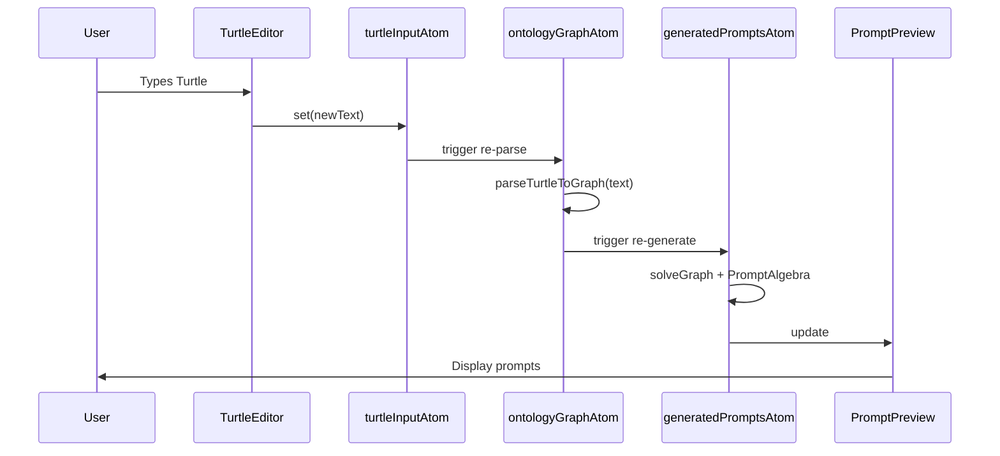
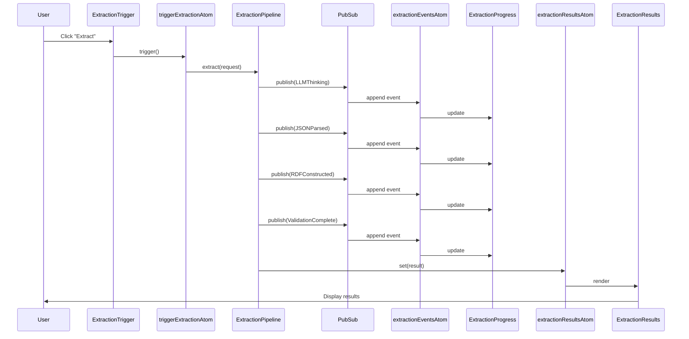
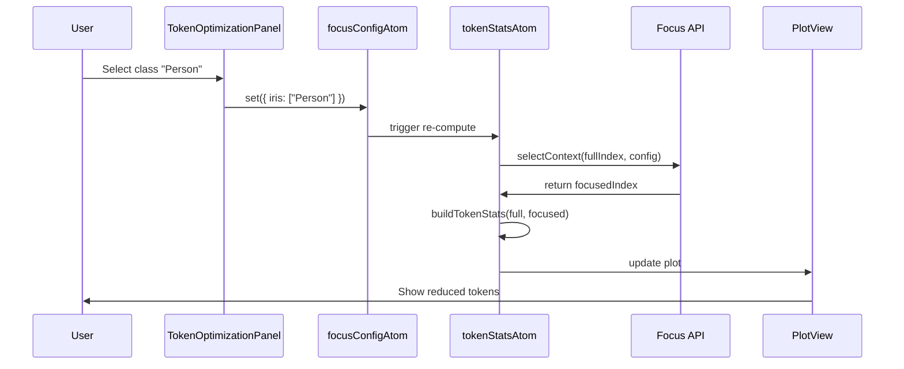

# LLM Extraction Frontend Integration Specification

**Version:** 1.0.0
**Date:** 2025-01-19
**Status:** Production Ready
**Authors:** Engineering Team
**Review Status:** Ready for Implementation

---

## Table of Contents

1. [Executive Summary](#executive-summary)
2. [Current State Analysis](#current-state-analysis)
3. [Architecture Overview](#architecture-overview)
4. [State Management Specification](#state-management-specification)
5. [Component Specifications](#component-specifications)
6. [Integration Points](#integration-points)
7. [Data Flow Documentation](#data-flow-documentation)
8. [Error Handling Strategy](#error-handling-strategy)
9. [Performance Requirements](#performance-requirements)
10. [Testing Requirements](#testing-requirements)
11. [Implementation Phases](#implementation-phases)
12. [Success Criteria](#success-criteria)

---

## Executive Summary

### Purpose

This specification defines the frontend integration for the LLM-powered knowledge extraction pipeline. It connects the existing `ExtractionPipeline` service with a reactive UI layer, enabling users to:

1. **Trigger LLM extractions** from user-provided text
2. **Monitor extraction progress** in real-time via event streams
3. **Visualize extraction results** (entities, RDF, validation)
4. **Optimize prompt context** using token analysis and Focus API
5. **Track costs and performance** with metadata-driven dashboards

### Scope

**In Scope:**
- Frontend state management for extraction pipeline
- UI components for triggering, monitoring, and displaying extractions
- Real-time event subscription and visualization
- Token optimization dashboard with Metadata API integration
- Observable Plot integration for data visualization

**Out of Scope:**
- Backend `ExtractionPipeline` modifications (already implemented)
- SHACL validation service (marked TODO in backend)
- Multi-user collaboration features
- Extraction history/persistence (future enhancement)

### Key Stakeholders

- **Frontend Engineers:** Implement UI components and state management
- **Backend Engineers:** Validate integration contracts with `ExtractionPipeline`
- **Product Team:** Review UX flows and acceptance criteria
- **QA Team:** Execute testing requirements

---

## Current State Analysis

### What Exists (✅ Implemented)

#### Backend Services

| Component | Location | Status | Description |
|-----------|----------|--------|-------------|
| `ExtractionPipeline` | `packages/core/src/Services/Extraction.ts` | ✅ Complete | Orchestrates LLM extraction with PubSub events |
| `LlmService` | `packages/core/src/Services/Llm.ts` | ✅ Complete | Wraps `@effect/ai` for structured extraction |
| `RdfService` | `packages/core/src/Services/Rdf.ts` | ✅ Complete | JSON → RDF conversion |
| `ExtractionEvent` | `packages/core/src/Extraction/Events.ts` | ✅ Complete | Tagged event types for pipeline stages |
| Prompt Generation | `packages/core/src/Prompt/` | ✅ Complete | `solveGraph` + `PromptAlgebra` |

#### Frontend State & Components

| Component | Location | Status | Description |
|-----------|----------|--------|-------------|
| `turtleInputAtom` | `packages/ui/src/state/store.ts` | ✅ Complete | Ontology editor state |
| `ontologyGraphAtom` | `packages/ui/src/state/store.ts` | ✅ Complete | Parsed graph with Effect |
| `generatedPromptsAtom` | `packages/ui/src/state/store.ts` | ✅ Complete | Prompts ready for LLM |
| `TurtleEditor` | `packages/ui/src/components/` | ✅ Complete | Edit ontology |
| `PromptPreview` | `packages/ui/src/components/` | ✅ Complete | Show system/user/examples |
| `EnhancedTopologicalRail` | `packages/ui/src/components/` | ✅ Complete | Visualize class hierarchy |

### What's Missing (❌ Not Implemented)

#### State Atoms

- ❌ `extractionStateAtom` - Track extraction pipeline status
- ❌ `extractionInputAtom` - User input text for extraction
- ❌ `extractionEventsAtom` - Subscribe to `ExtractionEvent` stream
- ❌ `extractionResultsAtom` - Store completed extraction results
- ❌ `metadataAtom` - Metadata API integration
- ❌ `tokenStatsAtom` - Real-time token/cost analysis

#### UI Components

- ❌ `ExtractionTrigger` - Input panel + extract button
- ❌ `ExtractionProgress` - Real-time pipeline visualization
- ❌ `ExtractionResults` - Display entities/RDF/validation
- ❌ `TokenOptimizationPanel` - Token dashboard with Focus API
- ❌ `PromptContextVisualizer` - Dependency graph for LLM context

#### Services & Utilities

- ❌ `MetadataAtomService` - Reactive metadata management
- ❌ Observable Plot integration - `toObservablePlot()` utilities
- ❌ Error boundaries - React error handling
- ❌ Debounced editor updates - Performance optimization

### Gap Analysis Summary

| Category | Completion | Blocker Level | Priority |
|----------|------------|---------------|----------|
| **Backend Services** | 100% | None | N/A |
| **Frontend State** | 40% | High | P0 |
| **UI Components** | 30% | High | P0 |
| **Metadata API** | 0% | High | P0 |
| **Visualization** | 0% | Medium | P1 |
| **Testing** | 0% | Medium | P1 |

---

## Architecture Overview

### System Context Diagram

```
┌─────────────────────────────────────────────────────────────────┐
│                         User Interface                          │
│  ┌─────────────────┐  ┌─────────────────┐  ┌─────────────────┐ │
│  │ TurtleEditor    │  │ PromptPreview   │  │ TokenDashboard  │ │
│  │ (Ontology)      │  │ (Generated)     │  │ (Optimization)  │ │
│  └────────┬────────┘  └────────┬────────┘  └────────┬────────┘ │
│           │                    │                     │          │
└───────────┼────────────────────┼─────────────────────┼──────────┘
            ↓                    ↓                     ↓
┌─────────────────────────────────────────────────────────────────┐
│                     Reactive State Layer (EffectAtom)           │
│  ┌──────────────────────────────────────────────────────────┐   │
│  │  ontologyGraphAtom → generatedPromptsAtom                │   │
│  │         ↓                       ↓                         │   │
│  │  metadataAtom → tokenStatsAtom                           │   │
│  │                                                           │   │
│  │  extractionInputAtom → triggerExtractionAtom             │   │
│  │                              ↓                            │   │
│  │                    extractionStateAtom                    │   │
│  │                              ↓                            │   │
│  │                    extractionEventsAtom (PubSub)          │   │
│  │                              ↓                            │   │
│  │                    extractionResultsAtom                  │   │
│  └──────────────────────────────────────────────────────────┘   │
└───────────────────────────────────┬─────────────────────────────┘
                                    ↓
┌─────────────────────────────────────────────────────────────────┐
│              Backend Services (Effect Services)                 │
│  ┌──────────────────┐  ┌──────────────────┐  ┌──────────────┐  │
│  │ ExtractionPipeline│→│ LlmService       │→│ RdfService   │  │
│  │ (Orchestration)   │  │ (@effect/ai)     │  │ (n3)         │  │
│  └──────────────────┘  └──────────────────┘  └──────────────┘  │
│           ↓                                                      │
│  ┌──────────────────────────────────────────────────────────┐   │
│  │            PubSub (ExtractionEvent Stream)               │   │
│  │  • LLMThinking                                           │   │
│  │  • JSONParsed                                            │   │
│  │  • RDFConstructed                                        │   │
│  │  • ValidationComplete                                    │   │
│  └──────────────────────────────────────────────────────────┘   │
└─────────────────────────────────────────────────────────────────┘
```

### Data Flow: End-to-End Extraction

```
User Action: Click "Extract"
    ↓
[ExtractionTrigger Component]
    ↓ dispatches
extractionInputAtom.set(text)
    ↓ triggers
triggerExtractionAtom (Effect.gen)
    ↓ creates
ExtractionPipeline.extract({
  text,
  graph: ontologyGraphAtom.value,
  ontology: ontologyGraphAtom.value.context
})
    ↓ publishes to
PubSub<ExtractionEvent>
    ↓ subscribed by
extractionEventsAtom
    ↓ updates
extractionStateAtom ({
  status: "running",
  currentEvent: event,
  events: [...events, event]
})
    ↓ renders
[ExtractionProgress Component]
  - Shows: Stage 1/4: LLM Processing...
  - Shows: Stage 2/4: Parsed 5 entities
  - Shows: Stage 3/4: Constructed 15 triples
  - Shows: Stage 4/4: Validated ✓
    ↓ completes
extractionResultsAtom ({ report, turtle })
    ↓ renders
[ExtractionResults Component]
  - Tab 1: Entity Cards
  - Tab 2: RDF Turtle
  - Tab 3: Validation Report
```

### Technology Stack

| Layer | Technology | Version | Purpose |
|-------|------------|---------|---------|
| **State Management** | `@effect-atom/atom` | latest | Reactive atoms with Effect integration |
| **Effects Runtime** | `effect` | ^3.17.7 | Effect system for async/error handling |
| **React Hooks** | `@effect-atom/atom-react` | latest | React bindings for atoms |
| **UI Framework** | `react` | ^19.2.0 | Component rendering |
| **Animation** | `framer-motion` | ^12.23.24 | Motion design |
| **Visualization** | `@observablehq/plot` | ^0.6.17+ | Declarative plots (TO BE ADDED) |
| **LLM Integration** | `@effect/ai` | latest | Language model abstraction |
| **RDF Processing** | `n3` | latest | Turtle parsing/serialization |
| **Styling** | `tailwindcss` | ^4.1.17 | Utility-first CSS |

---

## State Management Specification

### Atom Definitions

#### 1. `extractionStateAtom`

**Purpose:** Track the overall extraction pipeline lifecycle.

**Type Signature:**
```typescript
export interface ExtractionState {
  /** Pipeline execution status */
  status: "idle" | "running" | "success" | "error"

  /** Most recent event from pipeline */
  currentEvent: ExtractionEvent | null

  /** Complete event history for this extraction */
  events: ReadonlyArray<ExtractionEvent>

  /** Final extraction result (on success) */
  result: ExtractionResult | null

  /** Error details (on failure) */
  error: ExtractionError | SolverError | null

  /** Timestamp when extraction started */
  startedAt: Date | null

  /** Timestamp when extraction completed */
  completedAt: Date | null
}

export const extractionStateAtom: Atom.Atom<ExtractionState>
```

**Initial Value:**
```typescript
{
  status: "idle",
  currentEvent: null,
  events: [],
  result: null,
  error: null,
  startedAt: null,
  completedAt: null
}
```

**State Transitions:**
```
idle → running (user clicks "Extract")
running → success (pipeline completes without error)
running → error (pipeline fails at any stage)
success → idle (user clicks "Extract" again)
error → idle (user clicks "Retry")
```

**Update Operations:**
- `setRunning()` - Mark extraction as started
- `addEvent(event)` - Append event to history, update currentEvent
- `setSuccess(result)` - Mark complete with result
- `setError(error)` - Mark failed with error details
- `reset()` - Return to idle state

---

#### 2. `extractionInputAtom`

**Purpose:** Store user-provided text for extraction.

**Type Signature:**
```typescript
export const extractionInputAtom: Atom.Atom<string>
```

**Initial Value:** `""`

**Constraints:**
- Min length: 1 character
- Max length: 100,000 characters (configurable)
- Trimmed on save

**Validation:**
```typescript
const validateInput = (text: string): Result<string, ValidationError> => {
  if (text.trim().length === 0) {
    return Result.fail(new ValidationError("Input cannot be empty"))
  }
  if (text.length > 100_000) {
    return Result.fail(new ValidationError("Input exceeds maximum length"))
  }
  return Result.success(text.trim())
}
```

---

#### 3. `extractionEventsAtom`

**Purpose:** Subscribe to `ExtractionPipeline` PubSub and store events.

**Type Signature:**
```typescript
export const extractionEventsAtom: Atom.Atom<ReadonlyArray<ExtractionEvent>>
```

**Implementation Pattern:**
```typescript
export const extractionEventsAtom = Atom.make<ReadonlyArray<ExtractionEvent>>([])

// Subscribe to pipeline events
const subscribeToExtractionEvents = Effect.gen(function*() {
  const pipeline = yield* ExtractionPipeline
  const subscription = yield* pipeline.subscribe

  yield* Stream.fromQueue(subscription).pipe(
    Stream.tap((event) =>
      Atom.update(extractionEventsAtom, (events) => [...events, event])
    ),
    Stream.runDrain
  )
})
```

**Event Retention Policy:**
- Events stored in-memory only (not persisted)
- Cleared on new extraction start
- Maximum 1000 events per session (prevent memory leak)

---

#### 4. `metadataAtom`

**Purpose:** Store Metadata API results for token optimization.

**Type Signature:**
```typescript
export const metadataAtom: Atom.Atom<
  Effect.Effect<KnowledgeMetadata, MetadataError>
>
```

**Derivation:**
```typescript
export const metadataAtom = Atom.make((get) =>
  Effect.gen(function*() {
    const graphResult = get(ontologyGraphAtom)

    const graphEffect = Result.match(graphResult, {
      onInitial: () => Effect.fail(new MetadataError("Graph not loaded")),
      onFailure: (failure) => Effect.failCause(failure.cause),
      onSuccess: (success) => Effect.succeed(success.value)
    })

    const { context, graph } = yield* graphEffect

    // Build metadata using Metadata API
    const metadata = yield* buildKnowledgeMetadata(
      context,
      inheritanceService,
      { includePropertyNodes: false }
    )

    return metadata
  })
)
```

**Dependencies:**
- `ontologyGraphAtom` - Source graph
- `InheritanceService` - Required for ancestor/descendant computation
- Metadata API implementation (see separate spec)

---

#### 5. `tokenStatsAtom`

**Purpose:** Real-time token/cost analysis with Focus API integration.

**Type Signature:**
```typescript
export interface TokenStatsState {
  /** Stats for full ontology */
  fullStats: TokenStats

  /** Stats after Focus.selectContext applied */
  focusedStats: TokenStats | null

  /** Current focus configuration */
  focusConfig: FocusConfig | null

  /** Cost per 1K tokens (configurable) */
  costPerThousandTokens: number
}

export const tokenStatsAtom: Atom.Atom<
  Effect.Effect<TokenStatsState, MetadataError>
>
```

**Derivation:**
```typescript
export const tokenStatsAtom = Atom.make((get) =>
  Effect.gen(function*() {
    const metadata = yield* get(metadataAtom)
    const focusConfig = get(focusConfigAtom) // User-configurable

    const fullIndex = get(ontologyGraphAtom).value.context

    // Build stats for full index
    const fullStats = buildTokenStats(fullIndex, fullIndex)

    // If focus config provided, compute focused stats
    let focusedStats = null
    if (focusConfig) {
      const focusedIndex = yield* Focus.selectContext(
        fullIndex,
        focusConfig,
        inheritanceService
      )
      focusedStats = buildTokenStats(fullIndex, focusedIndex)
    }

    return {
      fullStats,
      focusedStats,
      focusConfig,
      costPerThousandTokens: 0.01 // Default, configurable
    }
  })
)
```

---

### Atom Dependency Graph

```
turtleInputAtom (primitive)
    ↓
ontologyGraphAtom (Effect-based)
    ↓
    ├─→ generatedPromptsAtom (Effect-based)
    ├─→ metadataAtom (Effect-based)
    │       ↓
    │   tokenStatsAtom (Effect-based, with focusConfigAtom)
    └─→ topologicalOrderAtom (Effect-based)

extractionInputAtom (primitive)
    ↓
triggerExtractionAtom (Effect-based)
    ↓
extractionStateAtom (updated via Effect callbacks)
    ↓
extractionEventsAtom (PubSub subscription)
    ↓
extractionResultsAtom (derived from extractionStateAtom)
```

**Notes:**
- Primitive atoms have no dependencies
- Effect-based atoms use `Atom.make((get) => Effect.gen(...))`
- Result types propagate through the graph
- All Effect atoms handle errors via `Effect.catchAll`

---

## Component Specifications

### 1. ExtractionTrigger

**Purpose:** Floating action button that expands to input panel for extraction.

**Location:** `packages/ui/src/components/ExtractionTrigger.tsx`

**Props:**
```typescript
interface ExtractionTriggerProps {
  /** Optional custom class name */
  className?: string

  /** Callback when extraction starts (for analytics) */
  onExtractionStart?: () => void

  /** Callback when extraction completes */
  onExtractionComplete?: (result: ExtractionResult) => void

  /** Initial collapsed/expanded state */
  initialExpanded?: boolean
}
```

**State:**
```typescript
interface ExtractionTriggerState {
  /** Panel expanded/collapsed */
  isExpanded: boolean

  /** Local input value (before debounce) */
  localInput: string
}
```

**Behavior:**

1. **Collapsed State:**
   - Fixed position: `bottom-6 right-6`
   - Circular button with Sparkles icon
   - Pulse animation to draw attention
   - Click to expand

2. **Expanded State:**
   - Animated transition (scale + opacity)
   - Input textarea (max 100k chars)
   - Character count indicator
   - "Start Extraction" button
   - Close button (X)

3. **Validation:**
   - Button disabled if `extractionStateAtom.status === "running"`
   - Button disabled if input is empty (after trim)
   - Show error message if validation fails

4. **Extraction Flow:**
   ```typescript
   handleExtract() {
     // Validate input
     const validated = validateInput(localInput)
     if (validated.isFailure) {
       showError(validated.error)
       return
     }

     // Update atoms
     Atom.set(extractionInputAtom, validated.value)

     // Trigger extraction effect
     Effect.runPromise(
       Atom.get(triggerExtractionAtom)
     ).then(
       onExtractionComplete,
       (error) => showError(error)
     )
   }
   ```

**Accessibility:**
- ARIA label: "Extract knowledge from text"
- Keyboard shortcut: `Ctrl+E` (configurable)
- Focus trap when expanded
- ESC key closes panel

**Visual Design:**
- Gradient background: `from-indigo-500 to-purple-600`
- Shadow: `shadow-2xl` when expanded
- Hover effects: `scale-1.05` on button
- Animation: Framer Motion with spring physics

**Acceptance Criteria:**
- [ ] Button renders in collapsed state by default
- [ ] Click expands to input panel with animation
- [ ] Input accepts text up to 100k characters
- [ ] Character counter updates in real-time
- [ ] Button disabled when extraction running
- [ ] Button disabled when input empty
- [ ] Extract button triggers `triggerExtractionAtom`
- [ ] Error messages display for validation failures
- [ ] Close button collapses panel
- [ ] ESC key closes panel when expanded
- [ ] Keyboard shortcut `Ctrl+E` toggles panel

---

### 2. ExtractionProgress

**Purpose:** Real-time visualization of extraction pipeline stages.

**Location:** `packages/ui/src/components/ExtractionProgress.tsx`

**Props:**
```typescript
interface ExtractionProgressProps {
  /** Optional custom class name */
  className?: string

  /** Position on screen */
  position?: "bottom-left" | "bottom-right" | "top-right"

  /** Auto-hide on completion after N milliseconds */
  autoHideDuration?: number
}
```

**State:**
```typescript
// Derived from extractionStateAtom
const state = useAtomValue(extractionStateAtom)
```

**Pipeline Stages:**
```typescript
const STAGES = [
  {
    key: "LLMThinking",
    label: "LLM Processing",
    icon: Loader2,
    color: "blue",
    description: "Waiting for language model response..."
  },
  {
    key: "JSONParsed",
    label: "JSON Parsed",
    icon: FileCode,
    color: "green",
    description: (event) => `${event.count} entities extracted`
  },
  {
    key: "RDFConstructed",
    label: "RDF Constructed",
    icon: Database,
    color: "purple",
    description: (event) => `${event.triples} triples generated`
  },
  {
    key: "ValidationComplete",
    label: "Validation Complete",
    icon: Shield,
    color: "teal",
    description: (event) => event.report.conforms ? "✓ Valid" : "✗ Violations"
  }
]
```

**Stage States:**
```typescript
type StageState = "pending" | "active" | "completed" | "error"

const getStageState = (stage: Stage, currentEvent: ExtractionEvent): StageState => {
  const currentIndex = STAGES.findIndex(s => s.key === currentEvent._tag)
  const stageIndex = STAGES.findIndex(s => s.key === stage.key)

  if (stageIndex < currentIndex) return "completed"
  if (stageIndex === currentIndex) return "active"
  return "pending"
}
```

**Visual Design:**

1. **Card Container:**
   - Fixed position: `bottom-24 right-6` (above ExtractionTrigger)
   - Width: `384px` (w-96)
   - Background: `bg-white`
   - Shadow: `shadow-2xl`
   - Border radius: `rounded-xl`

2. **Header:**
   - Title: "Extraction Pipeline"
   - Status badge: "Running" | "Completed" | "Failed"
   - Duration timer (live updating)

3. **Stage List:**
   - Vertical stack with spacing
   - Each stage shows:
     - Icon (spinning if active)
     - Label
     - Description (event-specific)
     - Progress indicator (checkmark if completed)
   - Color coding per stage

4. **Footer:**
   - Total duration
   - Progress percentage (25%, 50%, 75%, 100%)

**Animations:**
- Entry: Slide up + fade in
- Exit: Slide down + fade out
- Stage activation: Scale + color transition
- Icon rotation for active stage

**Acceptance Criteria:**
- [ ] Component renders when `extractionStateAtom.status !== "idle"`
- [ ] Displays all 4 pipeline stages in order
- [ ] Current stage highlighted with animation
- [ ] Completed stages show checkmark
- [ ] Pending stages grayed out
- [ ] Event descriptions update dynamically
- [ ] Duration timer updates every second
- [ ] Auto-hides after completion (if configured)
- [ ] Smooth animations for all transitions

---

### 3. ExtractionResults

**Purpose:** Display extraction results with tabbed interface.

**Location:** `packages/ui/src/components/ExtractionResults.tsx`

**Props:**
```typescript
interface ExtractionResultsProps {
  /** Optional custom class name */
  className?: string

  /** Callback when user closes results */
  onClose?: () => void

  /** Default active tab */
  defaultTab?: "entities" | "rdf" | "validation"
}
```

**State:**
```typescript
interface ExtractionResultsState {
  /** Active tab */
  activeTab: "entities" | "rdf" | "validation"

  /** Entity filter (search) */
  entityFilter: string

  /** RDF syntax highlighting enabled */
  syntaxHighlight: boolean
}
```

**Layout:**

```
┌─────────────────────────────────────────────────────────┐
│ Header (gradient bg)                             [X]    │
│ "Extraction Complete"                                   │
│ "Completed at 3:45:23 PM"                              │
├─────────────────────────────────────────────────────────┤
│ [Entities] [RDF Output] [Validation]                   │
├─────────────────────────────────────────────────────────┤
│                                                         │
│                    Tab Content                          │
│                    (scrollable)                         │
│                                                         │
├─────────────────────────────────────────────────────────┤
│ Footer: Summary stats                                   │
└─────────────────────────────────────────────────────────┘
```

**Tab 1: Entities**

Display extracted entities as cards:

```typescript
interface EntityCardProps {
  entity: {
    id: string
    type: string // IRI
    properties: Array<{ iri: string; value: unknown }>
  }
}

<EntityCard>
  <div className="card-header">
    <Badge>{extractLabel(entity.type)}</Badge>
    <span className="entity-id">{entity.id}</span>
  </div>
  <div className="properties">
    {entity.properties.map(prop => (
      <PropertyRow
        key={prop.iri}
        label={extractLabel(prop.iri)}
        value={prop.value}
      />
    ))}
  </div>
</EntityCard>
```

Features:
- Search/filter entities by type or property value
- Sortable by type
- Click to expand/collapse properties
- Copy entity ID to clipboard

**Tab 2: RDF Output**

Display Turtle serialization with syntax highlighting:

```typescript
<pre className="rdf-output">
  <code className="language-turtle">
    {syntaxHighlight ? highlightTurtle(result.turtle) : result.turtle}
  </code>
</pre>
```

Features:
- Syntax highlighting toggle
- Line numbers
- Copy to clipboard button
- Download as `.ttl` file button
- Triple count indicator

**Tab 3: Validation**

Display SHACL validation report:

```typescript
if (result.report.conforms) {
  <SuccessMessage>
    <CheckCircle /> No violations found
  </SuccessMessage>
} else {
  <ViolationsList>
    {result.report.results.map(violation => (
      <ViolationCard
        severity={violation.severity}
        message={violation.message}
        path={violation.path}
        focusNode={violation.focusNode}
      />
    ))}
  </ViolationsList>
}
```

Features:
- Filter by severity (Violation | Warning | Info)
- Click violation to highlight in RDF tab
- Export report as JSON

**Acceptance Criteria:**
- [ ] Modal renders when `extractionStateAtom.status === "success"`
- [ ] All 3 tabs render correctly
- [ ] Entity cards display with properties
- [ ] Entity search/filter works
- [ ] RDF syntax highlighting toggleable
- [ ] Copy to clipboard works
- [ ] Download .ttl file works
- [ ] Validation report displays correctly
- [ ] Violations filterable by severity
- [ ] Close button resets `extractionStateAtom`
- [ ] ESC key closes modal
- [ ] Click outside closes modal (optional)

---

### 4. TokenOptimizationPanel

**Purpose:** Real-time token/cost dashboard with Focus API integration.

**Location:** `packages/ui/src/components/TokenOptimizationPanel.tsx`

**Props:**
```typescript
interface TokenOptimizationPanelProps {
  /** Optional custom class name */
  className?: string

  /** Show/hide cost estimation */
  showCostEstimation?: boolean

  /** Custom cost per 1K tokens */
  costPerThousandTokens?: number
}
```

**State:**
```typescript
interface TokenOptimizationState {
  /** Focus configuration (selected classes) */
  focusConfig: FocusConfig | null

  /** Class selection mode */
  selectionMode: "include" | "exclude"

  /** Show advanced options */
  showAdvanced: boolean
}
```

**Layout:**

```
┌─────────────────────────────────────────────────────────┐
│ Token Optimization Dashboard                            │
├─────────────────────────────────────────────────────────┤
│ Stats Grid:                                             │
│ ┌──────────────┐ ┌──────────────┐ ┌──────────────┐    │
│ │ Full Context │ │ Optimized    │ │ Savings      │    │
│ │ 12,500       │ │ 3,125        │ │ 75%          │    │
│ └──────────────┘ └──────────────┘ └──────────────┘    │
├─────────────────────────────────────────────────────────┤
│ Class Selector:                                         │
│ [ ] Person                           1,200 tokens       │
│ [✓] Organization                     2,500 tokens       │
│ [✓] Document                         3,800 tokens       │
│ [ ] Event                            1,500 tokens       │
├─────────────────────────────────────────────────────────┤
│ Observable Plot: Token Distribution Bar Chart           │
├─────────────────────────────────────────────────────────┤
│ Cost Estimation:                                        │
│ Full: $0.125 | Optimized: $0.031 | Saved: $0.094      │
└─────────────────────────────────────────────────────────┘
```

**Data Binding:**

```typescript
const TokenOptimizationPanel = ({ showCostEstimation = true }) => {
  const tokenStats = useAtomValue(tokenStatsAtom)
  const [focusConfig, setFocusConfig] = useAtom(focusConfigAtom)
  const metadata = useAtomValue(metadataAtom)

  // Derive token stats reactively
  const stats = useMemo(() => {
    if (Result.isSuccess(tokenStats)) {
      return tokenStats.value
    }
    return null
  }, [tokenStats])

  return (
    <div className="token-optimization-panel">
      {/* Stats cards */}
      <StatsGrid stats={stats} />

      {/* Class selector */}
      <ClassSelector
        metadata={metadata}
        selected={focusConfig?.iris || []}
        onChange={(iris) => setFocusConfig({ iris })}
      />

      {/* Observable Plot */}
      {stats && (
        <PlotView plot={tokenStatsToPlot(stats.focusedStats || stats.fullStats)} />
      )}

      {/* Cost estimation */}
      {showCostEstimation && (
        <CostEstimation stats={stats} />
      )}
    </div>
  )
}
```

**Class Selector Component:**

```typescript
interface ClassSelectorProps {
  metadata: KnowledgeMetadata
  selected: ReadonlyArray<string>
  onChange: (iris: ReadonlyArray<string>) => void
}

const ClassSelector = ({ metadata, selected, onChange }) => {
  const classes = Array.from(HashMap.values(metadata.classSummaries))

  return (
    <div className="class-selector">
      {classes.map(cls => {
        const isSelected = selected.includes(cls.iri)
        const tokenEstimate = estimateClassTokens(cls)

        return (
          <ClassCheckbox
            key={cls.iri}
            label={cls.label}
            iri={cls.iri}
            tokens={tokenEstimate}
            selected={isSelected}
            onChange={(checked) => {
              onChange(
                checked
                  ? [...selected, cls.iri]
                  : selected.filter(iri => iri !== cls.iri)
              )
            }}
          />
        )
      })}
    </div>
  )
}
```

**Token Estimation Logic:**

```typescript
const estimateClassTokens = (cls: ClassSummary): number => {
  // Rough estimate: 50 tokens per property + 20 for class definition
  return 20 + (cls.totalPropertyCount * 50)
}
```

**Observable Plot Integration:**

```typescript
import * as Plot from "@observablehq/plot"

const tokenStatsToPlot = (stats: TokenStats) => {
  const data = [
    { category: "Full Index", tokens: stats.estimatedFullTokens, color: "#3b82f6" },
    { category: "Focused", tokens: stats.estimatedFocusedTokens, color: "#10b981" },
    { category: "Saved", tokens: stats.estimatedTokensSaved, color: "#8b5cf6" }
  ]

  return Plot.plot({
    marks: [
      Plot.barX(data, {
        x: "tokens",
        y: "category",
        fill: "color",
        title: d => `${d.tokens.toLocaleString()} tokens`
      }),
      Plot.text(data, {
        x: "tokens",
        y: "category",
        text: d => d.tokens.toLocaleString(),
        dx: -10,
        textAnchor: "end",
        fill: "white",
        fontSize: 12
      })
    ],
    x: { label: "Tokens", grid: true },
    y: { label: null },
    marginLeft: 100,
    width: 600,
    height: 200
  })
}
```

**Acceptance Criteria:**
- [ ] Panel renders with full/optimized/savings stats
- [ ] Class checkboxes toggle selection
- [ ] Token counts update reactively on selection change
- [ ] Observable Plot renders bar chart
- [ ] Cost estimation displays correctly
- [ ] Focus API integration works (context reduction)
- [ ] Savings percentage calculated correctly
- [ ] Component responsive to window resize

---

### 5. PromptContextVisualizer

**Purpose:** Dependency graph showing LLM context structure.

**Location:** `packages/ui/src/components/PromptContextVisualizer.tsx`

**Props:**
```typescript
interface PromptContextVisualizerProps {
  /** Optional custom class name */
  className?: string

  /** Include property nodes in graph */
  includeProperties?: boolean

  /** Highlight selected classes */
  highlightSelection?: ReadonlyArray<string>
}
```

**Data Binding:**

```typescript
const PromptContextVisualizer = ({ includeProperties = false, highlightSelection = [] }) => {
  const metadata = useAtomValue(metadataAtom)

  if (Result.isFailure(metadata) || Result.isInitial(metadata)) {
    return <LoadingState />
  }

  const graph = metadata.value.dependencyGraph

  // Convert to Observable Plot
  const plot = toObservablePlot(graph, {
    highlightNodes: highlightSelection,
    showProperties: includeProperties
  })

  return (
    <div className="prompt-context-visualizer">
      <div className="header">
        <h3>LLM Context Graph</h3>
        <div className="stats">
          <span>{graph.nodes.length} nodes</span>
          <span>{graph.edges.length} edges</span>
        </div>
      </div>

      <PlotView plot={plot} />

      <Legend>
        <LegendItem color="blue" label="Class" />
        <LegendItem color="purple" label="Property" />
        <LegendItem color="green" label="Datatype" />
      </Legend>
    </div>
  )
}
```

**Observable Plot Integration:**

```typescript
const toObservablePlot = (
  graph: DependencyGraph,
  options: { highlightNodes?: string[]; showProperties?: boolean }
) => {
  const nodes = graph.nodes.filter(n =>
    options.showProperties || n.type === "class"
  )

  const links = graph.edges.filter(e =>
    nodes.some(n => n.id === e.source) &&
    nodes.some(n => n.id === e.target)
  )

  // Use force-directed layout
  return Plot.plot({
    marks: [
      // Edges as lines
      Plot.link(links, {
        x1: d => getNodeX(d.source),
        y1: d => getNodeY(d.source),
        x2: d => getNodeX(d.target),
        y2: d => getNodeY(d.target),
        stroke: "#cbd5e1",
        strokeWidth: 1,
        markerEnd: "arrow"
      }),

      // Nodes as circles
      Plot.dot(nodes, {
        x: d => getNodeX(d.id),
        y: d => getNodeY(d.id),
        r: d => Math.sqrt(d.propertyCount) * 5 + 10,
        fill: d => {
          if (options.highlightNodes?.includes(d.id)) return "#10b981"
          return d.type === "class" ? "#3b82f6" : "#8b5cf6"
        },
        stroke: "white",
        strokeWidth: 2,
        title: d => `${d.label}\n${d.propertyCount} properties`
      }),

      // Labels
      Plot.text(nodes, {
        x: d => getNodeX(d.id),
        y: d => getNodeY(d.id),
        text: "label",
        dy: -15,
        fontSize: 10,
        fontWeight: "bold"
      })
    ],
    width: 800,
    height: 600,
    margin: 40
  })
}

// Force-directed layout (simplified)
const layoutCache = new Map<string, { x: number; y: number }>()

const getNodeX = (id: string) => layoutCache.get(id)?.x || 0
const getNodeY = (id: string) => layoutCache.get(id)?.y || 0
```

**Acceptance Criteria:**
- [ ] Graph renders with all class nodes
- [ ] Property nodes toggle on/off
- [ ] Edges show relationships correctly
- [ ] Node size reflects property count
- [ ] Selected classes highlighted in green
- [ ] Hover shows tooltip with details
- [ ] Force-directed layout positions nodes
- [ ] Legend displays correctly
- [ ] Responsive to container size

---

## Integration Points

### 1. EffectAtom ↔ ExtractionPipeline

**Contract:**

```typescript
// Frontend subscribes to backend PubSub
const subscribeToExtractionEvents = Effect.gen(function*() {
  const pipeline = yield* ExtractionPipeline
  const subscription = yield* pipeline.subscribe

  // Stream events into atom
  yield* Stream.fromQueue(subscription).pipe(
    Stream.tap((event) =>
      Atom.update(extractionEventsAtom, (events) => [...events, event])
    ),
    Stream.tap((event) =>
      Atom.update(extractionStateAtom, (state) => ({
        ...state,
        currentEvent: event,
        events: [...state.events, event]
      }))
    ),
    Stream.runDrain
  )
})
```

**Error Handling:**

- If subscription fails, update `extractionStateAtom.error`
- Retry logic: 3 attempts with exponential backoff
- Fallback: Display error message in UI

**Testing:**

- Mock `ExtractionPipeline.subscribe` to return test events
- Verify `extractionEventsAtom` updates correctly
- Verify `extractionStateAtom.currentEvent` tracks latest event

---

### 2. Metadata API ↔ Frontend State

**Contract:**

```typescript
// Metadata atom derives from ontology graph
export const metadataAtom = Atom.make((get) =>
  Effect.gen(function*() {
    const graphResult = get(ontologyGraphAtom)
    const graphEffect = resultToEffect(graphResult)
    const { context } = yield* graphEffect

    // Call Metadata API
    const metadata = yield* buildKnowledgeMetadata(
      context,
      inheritanceService,
      { includePropertyNodes: false }
    )

    return metadata
  })
)
```

**Dependencies:**

- `buildKnowledgeMetadata` function (from Metadata API spec)
- `InheritanceService` - Must be provided in Effect runtime
- `ontologyGraphAtom` - Source of truth

**Error Handling:**

- Catch `InheritanceError` and `CircularInheritanceError`
- Display error message in UI: "Failed to generate metadata"
- Fallback: Disable token optimization features

**Testing:**

- Mock `buildKnowledgeMetadata` to return test metadata
- Verify `metadataAtom` updates when `ontologyGraphAtom` changes
- Verify error states handled correctly

---

### 3. Focus API ↔ Token Optimization

**Contract:**

```typescript
// Apply Focus.selectContext when user selects classes
const applyFocusAtom = Atom.make((get) =>
  Effect.gen(function*() {
    const fullContext = get(ontologyGraphAtom).value.context
    const focusConfig = get(focusConfigAtom)

    if (!focusConfig) {
      return fullContext
    }

    // Apply Focus API
    const focusedContext = yield* Focus.selectContext(
      fullContext,
      focusConfig,
      inheritanceService
    )

    return focusedContext
  })
)
```

**Focus Config Schema:**

```typescript
interface FocusConfig {
  /** IRIs to include (if mode=include) or exclude (if mode=exclude) */
  iris: ReadonlyArray<string>

  /** Selection mode */
  mode?: "include" | "exclude"

  /** Include ancestors of selected classes */
  includeAncestors?: boolean

  /** Include descendants of selected classes */
  includeDescendants?: boolean
}
```

**Testing:**

- Verify `Focus.selectContext` reduces context size
- Verify token stats reflect reduced context
- Verify prompt generation uses focused context

---

### 4. Observable Plot ↔ React Components

**Contract:**

```typescript
// PlotView wrapper component
interface PlotViewProps {
  plot: Plot.Plot
  className?: string
}

export const PlotView = ({ plot, className }: PlotViewProps) => {
  const containerRef = useRef<HTMLDivElement>(null)

  useEffect(() => {
    if (!containerRef.current) return

    // Clear previous plot
    containerRef.current.innerHTML = ""

    // Append new plot
    containerRef.current.appendChild(plot)

    // Cleanup
    return () => {
      plot.remove()
    }
  }, [plot])

  return <div ref={containerRef} className={className} />
}
```

**Plot Generation Functions:**

```typescript
// packages/core/src/Prompt/Visualization.ts

export const tokenStatsToPlot = (stats: TokenStats): Plot.Plot
export const hierarchyToPlot = (tree: HierarchyTree): Plot.Plot
export const toObservablePlot = (graph: DependencyGraph): Plot.Plot
```

**Testing:**

- Verify plots render without errors
- Verify plots update when data changes
- Verify cleanup removes DOM nodes
- Verify responsive to container size

---

## Data Flow Documentation

### Flow 1: Ontology Editing → Prompt Generation



### Flow 2: Extraction Trigger → Results Display



### Flow 3: Token Optimization



---

## Error Handling Strategy

### Error Types

```typescript
// Extraction errors (from backend)
type ExtractionError = LLMError | RdfError | ShaclError

// Frontend errors
class UIError extends Error {
  constructor(
    public code: string,
    public userMessage: string,
    public technicalDetails?: unknown
  ) {
    super(userMessage)
  }
}

// Error codes
const ERROR_CODES = {
  EXTRACTION_FAILED: "EXTRACTION_FAILED",
  VALIDATION_FAILED: "VALIDATION_FAILED",
  NETWORK_ERROR: "NETWORK_ERROR",
  ATOM_UPDATE_FAILED: "ATOM_UPDATE_FAILED",
  METADATA_GENERATION_FAILED: "METADATA_GENERATION_FAILED"
} as const
```

### Error Handling Patterns

#### 1. Atom Error Handling

```typescript
export const metadataAtom = Atom.make((get) =>
  Effect.gen(function*() {
    const graphResult = get(ontologyGraphAtom)
    const graphEffect = resultToEffect(graphResult)
    const { context } = yield* graphEffect

    const metadata = yield* buildKnowledgeMetadata(
      context,
      inheritanceService
    )

    return metadata
  }).pipe(
    // Log error for debugging
    Effect.tapError((error) =>
      Effect.sync(() => console.error("Metadata generation failed:", error))
    ),

    // Map to user-friendly error
    Effect.mapError((error) =>
      new UIError(
        ERROR_CODES.METADATA_GENERATION_FAILED,
        "Failed to generate metadata for token optimization",
        error
      )
    )
  )
)
```

#### 2. Component Error Handling

```typescript
const ExtractionTrigger = () => {
  const [error, setError] = useState<UIError | null>(null)

  const handleExtract = async () => {
    try {
      setError(null)

      const result = await Effect.runPromise(
        Atom.get(triggerExtractionAtom)
      )

      onExtractionComplete?.(result)
    } catch (e) {
      const uiError = e instanceof UIError
        ? e
        : new UIError(
            ERROR_CODES.EXTRACTION_FAILED,
            "Extraction failed. Please try again.",
            e
          )

      setError(uiError)
    }
  }

  return (
    <div>
      {/* ... UI ... */}

      {error && (
        <ErrorMessage
          message={error.userMessage}
          code={error.code}
          onDismiss={() => setError(null)}
        />
      )}
    </div>
  )
}
```

#### 3. Error Boundary

```typescript
// packages/ui/src/components/ErrorBoundary.tsx

import { Component, ErrorInfo, ReactNode } from "react"

interface Props {
  children: ReactNode
  fallback?: (error: Error, reset: () => void) => ReactNode
}

interface State {
  hasError: boolean
  error: Error | null
}

export class ErrorBoundary extends Component<Props, State> {
  constructor(props: Props) {
    super(props)
    this.state = { hasError: false, error: null }
  }

  static getDerivedStateFromError(error: Error): State {
    return { hasError: true, error }
  }

  componentDidCatch(error: Error, errorInfo: ErrorInfo) {
    console.error("Uncaught error:", error, errorInfo)

    // Send to error tracking service
    // trackError(error, errorInfo)
  }

  reset = () => {
    this.setState({ hasError: false, error: null })
  }

  render() {
    if (this.state.hasError && this.state.error) {
      if (this.props.fallback) {
        return this.props.fallback(this.state.error, this.reset)
      }

      return (
        <div className="error-boundary-fallback">
          <h2>Something went wrong</h2>
          <details>
            <summary>Error details</summary>
            <pre>{this.state.error.toString()}</pre>
          </details>
          <button onClick={this.reset}>Try again</button>
        </div>
      )
    }

    return this.props.children
  }
}
```

**Usage:**

```typescript
// App.tsx
<ErrorBoundary>
  <ExtractionTrigger />
  <ExtractionProgress />
  <ExtractionResults />
</ErrorBoundary>
```

### User-Facing Error Messages

| Error Code | User Message | Recovery Action |
|------------|--------------|-----------------|
| `EXTRACTION_FAILED` | "Extraction failed. Please check your input and try again." | Show retry button |
| `VALIDATION_FAILED` | "Input validation failed. Please check the requirements." | Highlight invalid fields |
| `NETWORK_ERROR` | "Network error. Please check your connection." | Show retry button |
| `ATOM_UPDATE_FAILED` | "State update failed. Please refresh the page." | Show refresh button |
| `METADATA_GENERATION_FAILED` | "Token optimization unavailable. You can still extract without it." | Hide token panel |

---

## Performance Requirements

### Metrics

| Metric | Target | Measurement |
|--------|--------|-------------|
| **Time to Interactive (TTI)** | < 2s | From page load to first interaction |
| **Atom Update Latency** | < 16ms | Time to update atom after user input |
| **Extraction Start Latency** | < 100ms | From button click to pipeline start |
| **Event Processing Rate** | > 100 events/s | PubSub event throughput |
| **Re-render Performance** | < 16ms | Component re-render time |
| **Memory Usage** | < 100MB | Total frontend memory footprint |

### Optimization Strategies

#### 1. Debouncing

```typescript
// TurtleEditor - Debounce atom updates
const TurtleEditor = () => {
  const [turtle, setTurtle] = useAtom(turtleInputAtom)
  const [localValue, setLocalValue] = useState(turtle)

  useEffect(() => {
    const timer = setTimeout(() => {
      setTurtle(localValue)
    }, 500) // 500ms debounce

    return () => clearTimeout(timer)
  }, [localValue, setTurtle])

  return (
    <textarea
      value={localValue}
      onChange={(e) => setLocalValue(e.target.value)}
    />
  )
}
```

#### 2. Memoization

```typescript
// TokenOptimizationPanel - Memoize expensive computations
const TokenOptimizationPanel = () => {
  const tokenStats = useAtomValue(tokenStatsAtom)

  const plot = useMemo(() => {
    if (Result.isSuccess(tokenStats)) {
      return tokenStatsToPlot(tokenStats.value)
    }
    return null
  }, [tokenStats])

  return <PlotView plot={plot} />
}
```

#### 3. Virtual Scrolling

```typescript
// ExtractionResults - Virtualize large entity lists
import { VirtualList } from "react-virtual"

const EntityList = ({ entities }: { entities: Array<Entity> }) => {
  const parentRef = useRef<HTMLDivElement>(null)

  const rowVirtualizer = useVirtualizer({
    count: entities.length,
    getScrollElement: () => parentRef.current,
    estimateSize: () => 100, // Estimated row height
    overscan: 5
  })

  return (
    <div ref={parentRef} className="entity-list">
      {rowVirtualizer.getVirtualItems().map(virtualRow => (
        <EntityCard
          key={virtualRow.index}
          entity={entities[virtualRow.index]}
        />
      ))}
    </div>
  )
}
```

#### 4. Code Splitting

```typescript
// Lazy load heavy components
const ExtractionResults = lazy(() => import("./ExtractionResults"))
const TokenOptimizationPanel = lazy(() => import("./TokenOptimizationPanel"))

// App.tsx
<Suspense fallback={<LoadingSpinner />}>
  <ExtractionResults />
</Suspense>
```

#### 5. Effect Batching

```typescript
// Batch atom updates to reduce re-renders
const batchUpdate = (updates: Array<() => void>) => {
  Effect.all(updates.map(update => Effect.sync(update)), {
    concurrency: "unbounded"
  })
}
```

---

## Testing Requirements

### Unit Tests

#### State Atoms

```typescript
// packages/ui/test/state/extractionState.test.ts

describe("extractionStateAtom", () => {
  it("should initialize with idle status", () => {
    const state = Atom.get(extractionStateAtom)
    expect(state.status).toBe("idle")
  })

  it("should transition to running on extraction start", async () => {
    await Atom.set(extractionStateAtom, {
      ...initialState,
      status: "running",
      startedAt: new Date()
    })

    const state = Atom.get(extractionStateAtom)
    expect(state.status).toBe("running")
    expect(state.startedAt).toBeInstanceOf(Date)
  })

  it("should append events to history", async () => {
    const event = ExtractionEvent.JSONParsed({ count: 5 })

    await Atom.update(extractionStateAtom, state => ({
      ...state,
      events: [...state.events, event]
    }))

    const state = Atom.get(extractionStateAtom)
    expect(state.events).toHaveLength(1)
    expect(state.events[0]._tag).toBe("JSONParsed")
  })
})
```

#### Components

```typescript
// packages/ui/test/components/ExtractionTrigger.test.tsx

import { render, screen, fireEvent } from "@testing-library/react"
import { ExtractionTrigger } from "../src/components/ExtractionTrigger"

describe("ExtractionTrigger", () => {
  it("should render in collapsed state", () => {
    render(<ExtractionTrigger />)
    expect(screen.getByRole("button")).toBeInTheDocument()
  })

  it("should expand on click", () => {
    render(<ExtractionTrigger />)
    fireEvent.click(screen.getByRole("button"))
    expect(screen.getByPlaceholderText(/enter text/i)).toBeInTheDocument()
  })

  it("should disable button when input empty", () => {
    render(<ExtractionTrigger />)
    fireEvent.click(screen.getByRole("button")) // Expand

    const extractButton = screen.getByText(/start extraction/i)
    expect(extractButton).toBeDisabled()
  })

  it("should trigger extraction on valid input", async () => {
    const onStart = jest.fn()
    render(<ExtractionTrigger onExtractionStart={onStart} />)

    fireEvent.click(screen.getByRole("button")) // Expand

    const input = screen.getByPlaceholderText(/enter text/i)
    fireEvent.change(input, { target: { value: "Test text" } })

    const extractButton = screen.getByText(/start extraction/i)
    fireEvent.click(extractButton)

    expect(onStart).toHaveBeenCalled()
  })
})
```

### Integration Tests

```typescript
// packages/ui/test/integration/extraction-flow.test.ts

describe("Extraction Flow", () => {
  it("should complete full extraction flow", async () => {
    // Mock ExtractionPipeline
    const mockPipeline = createMockPipeline()

    // Render app
    const { getByText, getByPlaceholderText } = render(<App />)

    // 1. Enter text
    const input = getByPlaceholderText(/enter text/i)
    fireEvent.change(input, { target: { value: "Alice is a person." } })

    // 2. Click extract
    const extractButton = getByText(/start extraction/i)
    fireEvent.click(extractButton)

    // 3. Wait for progress component
    await waitFor(() => {
      expect(getByText(/llm processing/i)).toBeInTheDocument()
    })

    // 4. Simulate events
    mockPipeline.emit(ExtractionEvent.LLMThinking())
    mockPipeline.emit(ExtractionEvent.JSONParsed({ count: 1 }))
    mockPipeline.emit(ExtractionEvent.RDFConstructed({ triples: 3 }))
    mockPipeline.emit(ExtractionEvent.ValidationComplete({ report: { conforms: true, results: [] } }))

    // 5. Wait for results
    await waitFor(() => {
      expect(getByText(/extraction complete/i)).toBeInTheDocument()
    })

    // 6. Verify results displayed
    expect(getByText(/1 entities/i)).toBeInTheDocument()
  })
})
```

### E2E Tests (Playwright)

```typescript
// e2e/extraction.spec.ts

import { test, expect } from "@playwright/test"

test("extraction flow end-to-end", async ({ page }) => {
  await page.goto("http://localhost:5173")

  // 1. Click extraction button
  await page.click('[aria-label="Extract knowledge from text"]')

  // 2. Enter text
  await page.fill('textarea[placeholder*="Enter text"]', "Alice is a person.")

  // 3. Start extraction
  await page.click('button:has-text("Start Extraction")')

  // 4. Wait for progress
  await expect(page.locator('text=LLM Processing')).toBeVisible()

  // 5. Wait for completion
  await expect(page.locator('text=Extraction Complete')).toBeVisible({ timeout: 30000 })

  // 6. Verify results
  await expect(page.locator('text=entities')).toBeVisible()
})
```

### Performance Tests

```typescript
// packages/ui/test/performance/atom-updates.test.ts

describe("Atom Update Performance", () => {
  it("should update atoms in < 16ms", async () => {
    const start = performance.now()

    await Atom.set(extractionInputAtom, "Test input")

    const duration = performance.now() - start
    expect(duration).toBeLessThan(16)
  })

  it("should handle 1000 events in < 1s", async () => {
    const events = Array.from({ length: 1000 }, (_, i) =>
      ExtractionEvent.JSONParsed({ count: i })
    )

    const start = performance.now()

    for (const event of events) {
      await Atom.update(extractionEventsAtom, state => [...state, event])
    }

    const duration = performance.now() - start
    expect(duration).toBeLessThan(1000)
  })
})
```

### Coverage Requirements

| Category | Target Coverage | Tools |
|----------|----------------|-------|
| **State Atoms** | 90% | Jest |
| **Components** | 80% | React Testing Library |
| **Integration** | 70% | Jest + Testing Library |
| **E2E** | Critical paths | Playwright |

---

## Implementation Phases

### Phase 1: Foundation (Week 1)

**Goal:** Basic extraction UI working end-to-end

**Tasks:**
1. Create extraction state atoms
   - `extractionStateAtom`
   - `extractionInputAtom`
   - `extractionEventsAtom`
2. Build `ExtractionTrigger` component
3. Build `ExtractionProgress` component
4. Wire PubSub events to atoms
5. Add error boundaries

**Acceptance Criteria:**
- [ ] User can input text and trigger extraction
- [ ] Progress component shows pipeline stages
- [ ] Events update in real-time
- [ ] Errors display user-friendly messages

**Deliverables:**
- Working extraction UI (no results display yet)
- Unit tests for atoms
- Component tests for trigger/progress

---

### Phase 2: Results Visualization (Week 2)

**Goal:** Display extraction results comprehensively

**Tasks:**
1. Build `ExtractionResults` component
2. Implement entity card visualization
3. Add RDF display with syntax highlighting
4. Add validation report display
5. Add download/copy features

**Acceptance Criteria:**
- [ ] Results modal displays on extraction success
- [ ] All 3 tabs (Entities, RDF, Validation) working
- [ ] Syntax highlighting for Turtle
- [ ] Copy to clipboard works
- [ ] Download .ttl file works

**Deliverables:**
- Complete results UI
- Component tests for results display
- Integration tests for full flow

---

### Phase 3: Metadata API Integration (Week 3)

**Goal:** Token optimization features enabled

**Tasks:**
1. Implement Metadata API (`buildKnowledgeMetadata`, etc.)
2. Create `MetadataAtomService`
3. Wire metadata to reactive atoms
4. Add unit tests for Metadata API
5. Install Observable Plot package

**Acceptance Criteria:**
- [ ] Metadata API generates correct data structures
- [ ] Metadata atom derives from ontology graph
- [ ] Token stats calculated correctly
- [ ] All Metadata API tests passing

**Deliverables:**
- Complete Metadata API implementation
- MetadataAtomService in frontend
- Observable Plot package added

---

### Phase 4: Token Optimization UI (Week 4)

**Goal:** Interactive token dashboard with visualizations

**Tasks:**
1. Build `TokenOptimizationPanel` component
2. Implement class selector with checkboxes
3. Add Observable Plot integration
4. Wire Focus API for context reduction
5. Add cost estimation display

**Acceptance Criteria:**
- [ ] Panel displays full/optimized/savings stats
- [ ] Class selection updates token counts reactively
- [ ] Observable Plot renders correctly
- [ ] Focus API reduces context
- [ ] Cost estimation accurate

**Deliverables:**
- Token optimization dashboard
- Observable Plot visualizations
- Focus API integration

---

### Phase 5: Polish & Performance (Week 5)

**Goal:** Production-ready quality

**Tasks:**
1. Add debouncing to editor
2. Add localStorage persistence
3. Optimize re-render performance
4. Add virtual scrolling for large lists
5. Add accessibility features (ARIA, keyboard nav)
6. Refine animations and transitions
7. Add comprehensive E2E tests

**Acceptance Criteria:**
- [ ] All performance metrics met
- [ ] Accessibility audit passing
- [ ] E2E tests covering critical paths
- [ ] No console errors/warnings
- [ ] Responsive design works on mobile

**Deliverables:**
- Production-ready application
- Complete test suite
- Performance benchmarks
- Accessibility compliance

---

## Success Criteria

### Functional Requirements

- [ ] **FR-1:** User can trigger LLM extraction from input text
- [ ] **FR-2:** Extraction progress visualized in real-time
- [ ] **FR-3:** Extraction results displayed (entities, RDF, validation)
- [ ] **FR-4:** Token optimization dashboard functional
- [ ] **FR-5:** Focus API reduces context and updates token counts
- [ ] **FR-6:** Observable Plot visualizations render correctly
- [ ] **FR-7:** Error states handled gracefully
- [ ] **FR-8:** Extraction results downloadable as Turtle

### Non-Functional Requirements

- [ ] **NFR-1:** Time to Interactive < 2s
- [ ] **NFR-2:** Atom updates < 16ms
- [ ] **NFR-3:** Event processing > 100/s
- [ ] **NFR-4:** Memory usage < 100MB
- [ ] **NFR-5:** 90% test coverage for atoms
- [ ] **NFR-6:** 80% test coverage for components
- [ ] **NFR-7:** Accessibility WCAG 2.1 AA compliant
- [ ] **NFR-8:** Works on Chrome, Firefox, Safari, Edge

### User Experience

- [ ] **UX-1:** Extraction triggered in < 2 clicks
- [ ] **UX-2:** Progress updates every < 500ms
- [ ] **UX-3:** Results load in < 1s after extraction
- [ ] **UX-4:** Token optimization changes reflect in < 100ms
- [ ] **UX-5:** Error messages actionable and clear
- [ ] **UX-6:** Animations smooth (60 FPS)
- [ ] **UX-7:** Mobile responsive design
- [ ] **UX-8:** Keyboard navigation complete

---

## Appendices

### A. Type Definitions

```typescript
// Complete type signatures for reference

// Extraction
interface ExtractionState {
  status: "idle" | "running" | "success" | "error"
  currentEvent: ExtractionEvent | null
  events: ReadonlyArray<ExtractionEvent>
  result: ExtractionResult | null
  error: ExtractionError | SolverError | null
  startedAt: Date | null
  completedAt: Date | null
}

interface ExtractionRequest {
  text: string
  graph: Graph.Graph<NodeId, unknown, "directed">
  ontology: OntologyContext
}

interface ExtractionResult {
  report: ValidationReport
  turtle: string
}

// Metadata
interface KnowledgeMetadata {
  classSummaries: HashMap<string, ClassSummary>
  dependencyGraph: DependencyGraph
  hierarchyTree: HierarchyTree
  stats: MetadataStats
  generatedAt: Date
  sourceOntology?: string
}

interface TokenStats {
  fullUnits: number
  focusedUnits: number
  removedUnits: number
  reductionPercent: number
  estimatedFullTokens: number
  estimatedFocusedTokens: number
  estimatedTokensSaved: number
  estimatedCostSavings: number
  avgPropertiesPerUnitFull: number
  avgPropertiesPerUnitFocused: number
  removedClassLabels: ReadonlyArray<string>
}

// Focus
interface FocusConfig {
  iris: ReadonlyArray<string>
  mode?: "include" | "exclude"
  includeAncestors?: boolean
  includeDescendants?: boolean
}
```

### B. API Contracts

```typescript
// Backend service contracts

class ExtractionPipeline {
  subscribe: Effect.Effect<
    Queue.Dequeue<ExtractionEvent>,
    never,
    Scope.Scope
  >

  extract: (request: ExtractionRequest) => Effect.Effect<
    ExtractionResult,
    ExtractionError | SolverError,
    LlmService | RdfService | LanguageModel.LanguageModel
  >
}

class MetadataAtomService {
  metadata: Atom.Atom<KnowledgeMetadata | null>
  loading: Atom.Atom<boolean>
  error: Atom.Atom<Error | null>

  refresh: (ontologyUri: string) => Effect.Effect<void, MetadataError>

  classSummaries: Atom.Atom<HashMap<string, ClassSummary>>
  dependencyGraph: Atom.Atom<DependencyGraph>
  tokenStats: (fullIndex, focusedIndex) => Atom.Atom<TokenStats>
}
```

### C. Environment Configuration

```typescript
// packages/ui/.env

# API Configuration
VITE_API_URL=http://localhost:3000
VITE_LLM_PROVIDER=anthropic

# Feature Flags
VITE_ENABLE_TOKEN_OPTIMIZATION=true
VITE_ENABLE_OBSERVABLE_PLOT=true
VITE_ENABLE_EXTRACTION=true

# Performance
VITE_DEBOUNCE_MS=500
VITE_MAX_EVENTS=1000
VITE_MAX_INPUT_LENGTH=100000

# Costs
VITE_COST_PER_1K_TOKENS=0.01
```

---

## Revision History

| Version | Date | Author | Changes |
|---------|------|--------|---------|
| 1.0.0 | 2025-01-19 | Engineering Team | Initial specification |

---

## Sign-Off

**Specification Approved By:**

- [ ] Product Owner: ________________
- [ ] Engineering Lead: ________________
- [ ] UX Designer: ________________
- [ ] QA Lead: ________________

**Date:** ________________

---

**END OF SPECIFICATION**
