# Effect-Ontology @core-v2 System Architecture

> **Version:** 2.2.0
> **Last Updated:** December 2025
> **Status:** Implementation Complete - Entity Resolution & Pre-computed Embeddings

## Table of Contents

1. [Overview](#overview)
2. [System Context](#system-context)
3. [Component Architecture](#component-architecture)
4. [Workflow Pipeline](#workflow-pipeline)
5. [Service Layer](#service-layer)
6. [Data Model](#data-model)
7. [Infrastructure](#infrastructure)
8. [Layer Composition](#layer-composition)
9. [API Reference](#api-reference)

---

## Overview

Effect-Ontology is a knowledge graph extraction system that transforms unstructured text into RDF triples using LLM-powered entity and relation extraction, guided by domain ontologies.

### Key Capabilities

- **Ontology-Guided Extraction**: Uses SKOS/OWL ontologies to constrain entity types and relation predicates
- **Durable Workflows**: @effect/workflow-based pipelines with PostgreSQL persistence for crash recovery
- **SSE Streaming**: Real-time batch state streaming via Server-Sent Events
- **Batch Processing**: 4-stage pipeline (Extract → Resolve → Validate → Ingest)
- **Entity Resolution**: Graph-based clustering for entity deduplication
- **SHACL Validation**: Optional shape-based constraint checking

---

## System Context

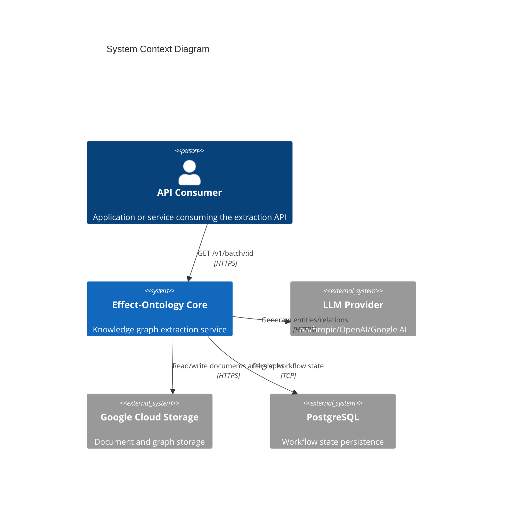

---

## Component Architecture

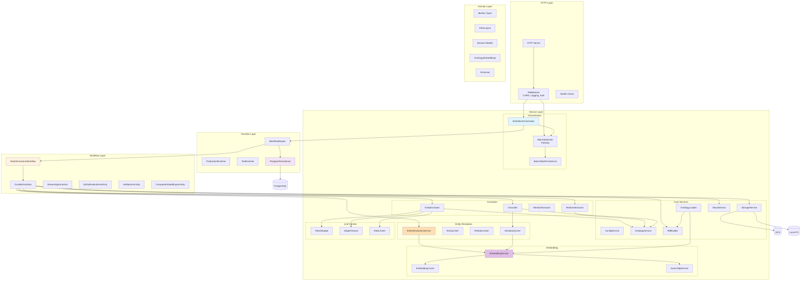

---

## Workflow Pipeline

### Batch Extraction Workflow

The core processing pipeline consists of 4 durable stages:

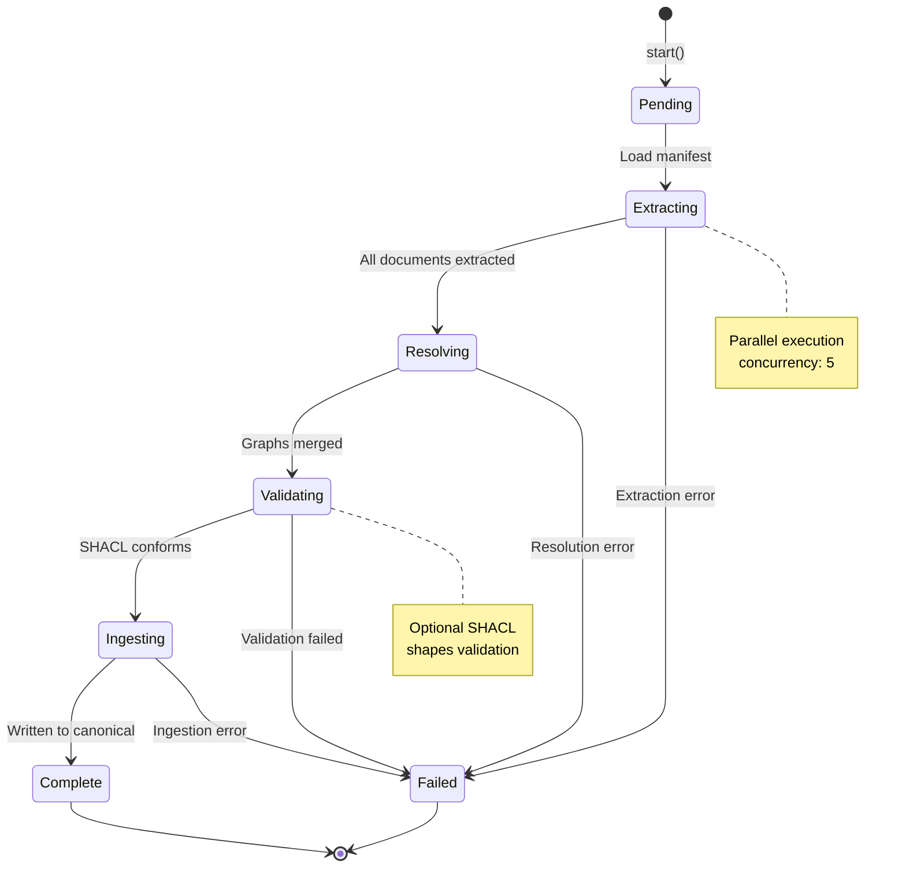

### Activity Sequence

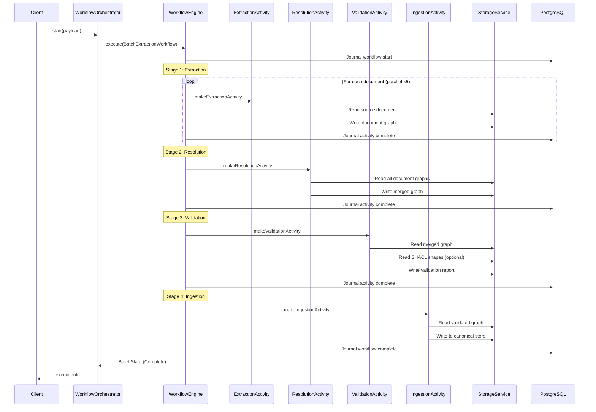

---

## Service Layer

### Service Dependency Graph

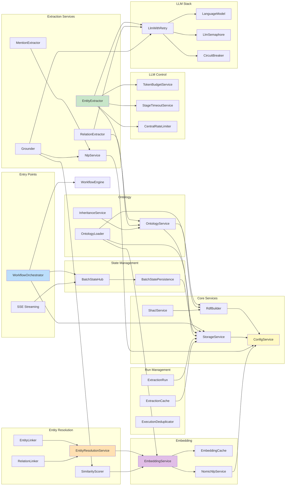

### Service Specifications

| Service | Purpose | Layer | Dependencies |
|---------|---------|-------|--------------|
| **Orchestration** ||||
| `WorkflowOrchestrator` | High-level batch workflow API | Service | WorkflowEngine, BatchStateHub |
| `BatchStateHub` | PubSub for real-time state changes | Service | PubSub |
| `BatchStatePersistence` | State snapshots in storage | Service | StorageService, KeyValueStore |
| **Extraction** ||||
| `EntityExtractor` | LLM-based named entity recognition | Service | LanguageModel, OntologyService |
| `RelationExtractor` | LLM-based relation extraction | Service | LanguageModel, OntologyService |
| `MentionExtractor` | Entity mention detection via NLP | Service | NlpService |
| `Grounder` | Entity grounding/linking | Service | NlpService, OntologyService |
| `SimilarityScorer` | Embedding-based entity similarity | Service | EmbeddingService |
| **Entity Resolution** ||||
| `EntityResolutionService` | Graph clustering and entity matching | Service | EmbeddingService |
| `EntityLinker` | Canonical entity ID queries | Util | EntityResolutionGraph |
| `RelationLinker` | Relation canonicalization | Service | EntityResolutionGraph |
| **Embedding** ||||
| `EmbeddingService` | Cache-through embedding wrapper | Service | NomicNlpService, EmbeddingCache |
| `EmbeddingCache` | Content-addressable embedding cache | Service | Clock, Ref |
| `NomicNlpService` | Local Nomic embedding model | Service | ConfigService |
| **Ontology** ||||
| `OntologyService` | SKOS/OWL ontology operations | Core | RdfBuilder, StorageService |
| `OntologyLoader` | Ontology + embeddings loading | Service | RdfBuilder, EmbeddingService, StorageService |
| `InheritanceService` | Class hierarchy property inheritance | Service | OntologyService |
| **Core Infrastructure** ||||
| `ConfigService` | Centralized configuration | Core | Environment |
| `StorageService` | Abstracted storage (GCS/Local/Memory) | Core | ConfigService |
| `RdfBuilder` | RDF parsing/serialization (N3.js) | Core | ConfigService |
| `ShaclService` | SHACL validation engine | Core | RdfBuilder |
| **Run Management** ||||
| `ExtractionRun` | Run management with artifact storage | Service | StorageService |
| `ExtractionCache` | Filesystem extraction result cache | Service | FileSystem |
| `ExecutionDeduplicator` | Idempotency key deduplication | Service | Ref |

---

## Data Model

### Branded Identity Types

```mermaid
classDiagram
    class BatchId {
        +String value
        +Pattern: batch-[a-f0-9]{12}
    }

    class DocumentId {
        +String value
        +Pattern: doc-[a-f0-9]{12}
    }

    class GcsUri {
        +String value
        +Pattern: gs://bucket/path
    }

    class OntologyVersion {
        +String value
        +Pattern: namespace/name@[a-f0-9]{16}
    }

    class Namespace {
        +String value
        +Pattern: [a-z][a-z0-9-]*
    }
```

### BatchState Union Type

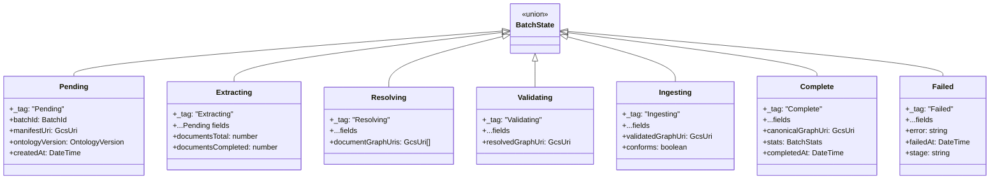

### Storage Path Layout

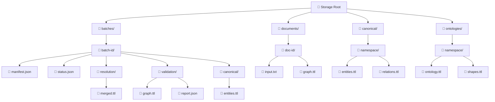

---

## Infrastructure

### GCP Architecture

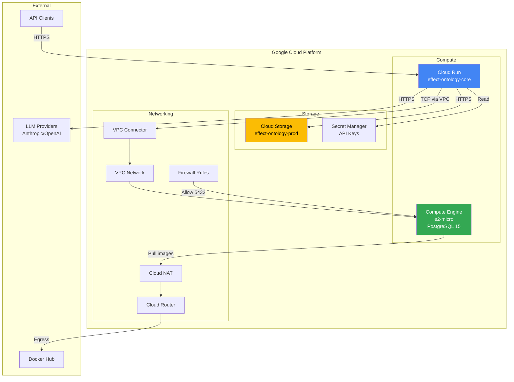

### Terraform Module Structure

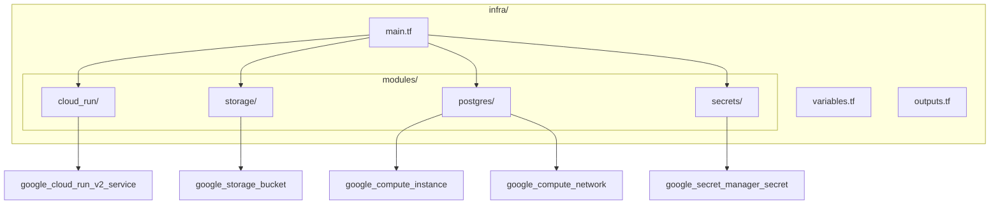

### Environment Configuration

| Variable | Description | Default |
|----------|-------------|---------|
| `LLM_PROVIDER` | LLM backend (anthropic/openai/google) | anthropic |
| `LLM_MODEL` | Model identifier | claude-haiku-4-5 |
| `LLM_API_KEY` | API key (from Secret Manager) | required |
| `STORAGE_TYPE` | Storage backend (gcs/local/memory) | local |
| `STORAGE_BUCKET` | GCS bucket name | - |
| `ONTOLOGY_PATH` | Path to ontology file | required |
| `POSTGRES_HOST` | PostgreSQL host | localhost |
| `POSTGRES_PORT` | PostgreSQL port | 5432 |
| `POSTGRES_DATABASE` | Database name | workflow |
| `POSTGRES_USER` | Database user | workflow |
| `POSTGRES_PASSWORD` | Database password (secret) | required |

---

## Layer Composition

### Effect Layer Stack

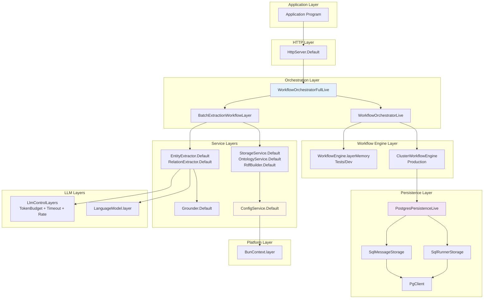

### Test vs Production Layers

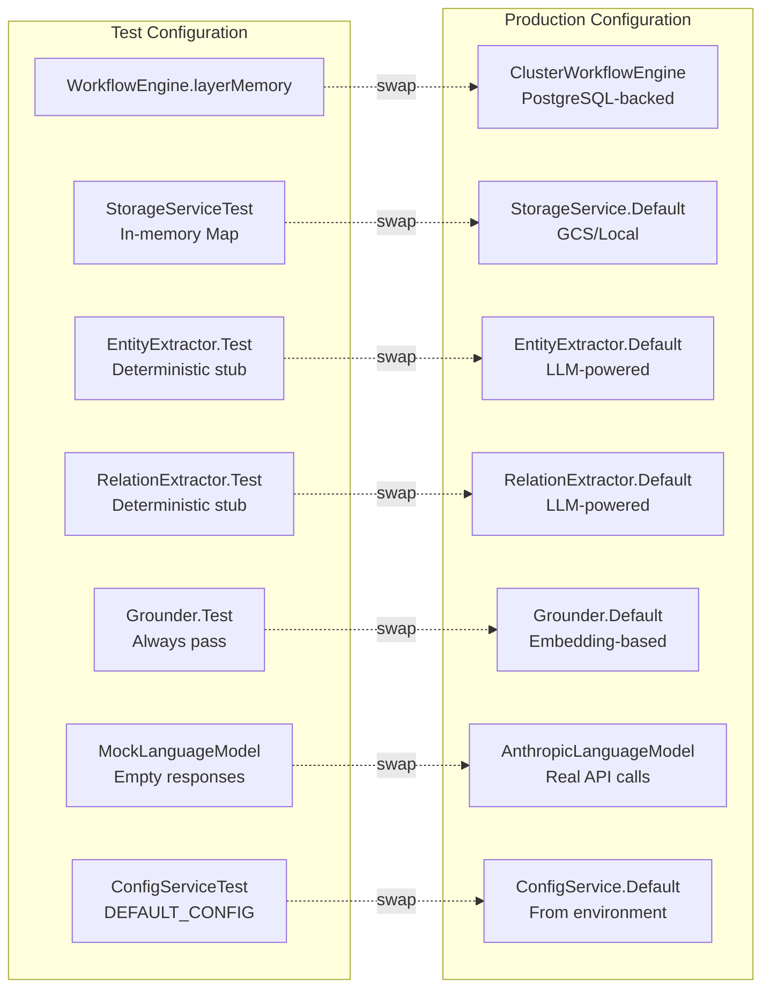

---

## API Reference

### REST Endpoints

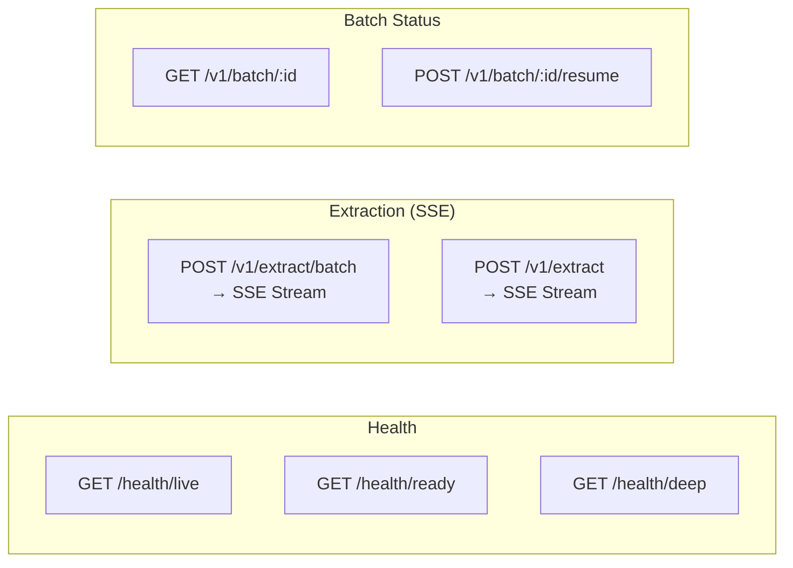

### SSE Streaming

The extraction endpoints return Server-Sent Events streaming `BatchState` transitions:

```
POST /v1/extract/batch
Content-Type: application/json
Accept: text/event-stream

← HTTP/1.1 200 OK
← Content-Type: text/event-stream

← event: state
← id: batch-abc123-Pending-1702300000000
← data: {"_tag":"Pending","batchId":"batch-abc123",...}

← event: state
← id: batch-abc123-Extracting-1702300001000
← data: {"_tag":"Extracting","documentsCompleted":1,"documentsTotal":3,...}

← retry: 15000

← event: state
← id: batch-abc123-Complete-1702300010000
← data: {"_tag":"Complete","stats":{...},...}
```

### SSE Deployment Configuration (Cloud Run)

Server-Sent Events require specific Cloud Run configuration for reliable streaming:

```bash
# Required settings for SSE
gcloud run services update SERVICE \
  --timeout=3600 \           # 60 min max (default 5 min is too short)
  --no-cpu-throttling \      # CPU always allocated during streaming
  --min-instances=1          # Prevent cold starts killing connections
```

| Setting | Default | Required | Purpose |
|---------|---------|----------|---------|
| `--timeout` | 300s | **3600s** | Prevents premature connection close |
| `--no-cpu-throttling` | throttled | **always-on** | Keeps CPU during idle streaming |
| `--min-instances` | 0 | **1+** | Avoids scale-to-zero killing connections |

**Important**: Clients must use **HTTP/1.1** for SSE connections. HTTP/2 has protocol compatibility issues with Cloud Run's load balancer for SSE streams.

```bash
# Client example (force HTTP/1.1)
curl --http1.1 -H "Accept: text/event-stream" https://SERVICE/v1/extract/batch
```

Required response headers (already configured in HttpServer.ts):

```text
Content-Type: text/event-stream
Cache-Control: no-cache, no-store, must-revalidate
Connection: keep-alive
X-Accel-Buffering: no
```

### BatchStatusResponse Union

The `GET /v1/batch/:id` endpoint returns a discriminated union:

| Variant | Description | HTTP Status |
|---------|-------------|-------------|
| `Active` | Workflow running or completed | 200 |
| `Suspended` | Workflow suspended (can resume) | 200 |
| `NotFound` | Batch ID not found | 404 |

### WorkflowOrchestrator Interface

```typescript
interface WorkflowOrchestrator {
  // Start workflow (fire-and-forget)
  start(payload: BatchWorkflowPayload): Effect<string, string>

  // Start and wait for completion
  startAndWait(payload: BatchWorkflowPayload): Effect<BatchState, string>

  // Poll for result
  poll(executionId: string): Effect<Workflow.Result<BatchState, string> | undefined>

  // Interrupt running workflow
  interrupt(executionId: string): Effect<void>

  // Resume suspended workflow
  resume(executionId: string): Effect<void>
}
```

### BatchRequest Schema (API Input)

```typescript
// Request body for POST /v1/extract/batch
// Server generates batchId and createdAt
const BatchRequest = Schema.Struct({
  ontologyUri: GcsUri,
  ontologyVersion: OntologyVersion,
  shaclUri: Schema.optional(GcsUri),
  targetNamespace: Namespace,
  documents: Schema.NonEmptyArray(Schema.Struct({
    documentId: Schema.optional(DocumentId),  // Server generates if omitted
    sourceUri: GcsUri,
    contentType: Schema.String,
    sizeBytes: Schema.optional(Schema.Number)
  }))
})
```

### BatchWorkflowPayload Schema (Internal)

```typescript
// Used internally for workflow execution
// Includes all fields for idempotency key derivation
const BatchWorkflowPayload = Schema.Struct({
  batchId: BatchId,
  manifestUri: GcsUri,
  ontologyVersion: OntologyVersion,
  ontologyUri: GcsUri,
  targetNamespace: Namespace,
  shaclUri: Schema.optional(GcsUri),
  documentIds: Schema.Array(DocumentId)
})
```

### BatchManifest Schema

```typescript
const BatchManifest = Schema.Struct({
  batchId: BatchId,
  ontologyUri: GcsUri,
  ontologyVersion: OntologyVersion,
  shaclUri: Schema.optional(GcsUri),
  targetNamespace: Namespace,
  documents: Schema.Array(Schema.Struct({
    documentId: DocumentId,
    sourceUri: GcsUri,
    contentType: Schema.String,
    sizeBytes: Schema.Number
  })),
  createdAt: Schema.DateTimeUtc
})
```

---

## File Reference

| Path | Purpose |
|------|---------|
| `src/Service/WorkflowOrchestrator.ts` | High-level workflow API with Result handling |
| `src/Service/BatchState.ts` | BatchStateHub (PubSub) + persistence |
| `src/Service/Config.ts` | Centralized configuration |
| `src/Service/Storage.ts` | Storage abstraction (GCS/Local/Memory) |
| `src/Service/Extraction.ts` | Entity/Relation extractors |
| `src/Service/Grounder.ts` | Entity grounding |
| `src/Workflow/Activities.ts` | @effect/workflow durable activities |
| `src/Workflow/StreamingExtraction.ts` | 2-stage extraction pipeline |
| `src/Workflow/EntityResolution.ts` | Graph-based entity resolution |
| `src/Runtime/HttpServer.ts` | HTTP routes + SSE streaming |
| `src/Runtime/ProductionRuntime.ts` | Production layer stack |
| `src/Runtime/TestRuntime.ts` | Test layer stack |
| `src/Runtime/ActivityRunner.ts` | Cloud Run Jobs activity dispatcher |
| `src/Domain/Identity.ts` | Branded ID types |
| `src/Domain/PathLayout.ts` | Type-safe storage paths |
| `src/Domain/Model/BatchWorkflow.ts` | BatchState union type |
| `src/Domain/Schema/Batch.ts` | BatchManifest, BatchWorkflowPayload |
| `src/Domain/Schema/BatchRequest.ts` | API request schema |
| `src/Domain/Schema/BatchStatusResponse.ts` | Active/Suspended/NotFound union |
| `src/Domain/Error/Workflow.ts` | WorkflowError, WorkflowSuspendedError |
| `infra/modules/postgres/` | Terraform for PostgreSQL |
| `infra/modules/cloud-run/` | Terraform for Cloud Run |

---

## Workflow Annotations

The `BatchExtractionWorkflow` uses @effect/workflow annotations for resilience:

| Annotation | Value | Purpose |
|------------|-------|---------|
| `SuspendOnFailure` | `true` | Suspend workflow on any error (can be resumed) |
| `CaptureDefects` | `true` | Capture unexpected errors in Result |
| `suspendedRetrySchedule` | Exponential backoff (5 retries) | Auto-retry suspended workflows |

```typescript
export const BatchExtractionWorkflow = Workflow.make({
  name: "batch-extraction",
  payload: BatchWorkflowPayload,
  success: BatchState,
  error: Schema.String,
  idempotencyKey: (p) => `${p.batchId}-${hashSemanticInputs(p)}`,
  annotations: Context.make(Workflow.SuspendOnFailure, true).pipe(
    Context.add(Workflow.CaptureDefects, true)
  ),
  suspendedRetrySchedule: Schedule.exponential("1 second").pipe(
    Schedule.compose(Schedule.recurs(5)),
    Schedule.jittered
  )
})
```
